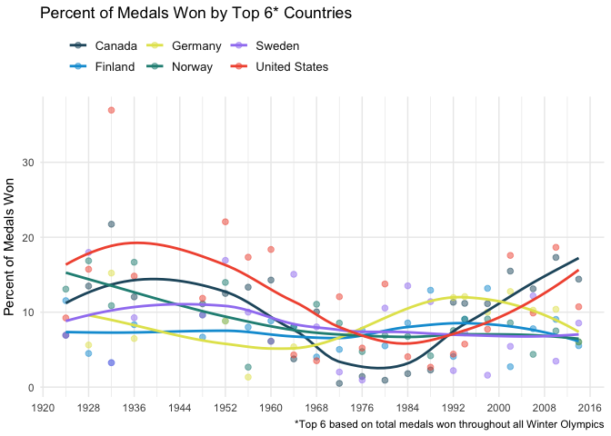

Winter Olympics Medals over Time
================================


## Scenario

Imagine you are the data scientist at a respected media outlet -- say the "New York Times". For the Winter Olympics coverage, your editor-in-chief asks you to analyze some data on the history of `Winter Olympics Medals by Year, Country, Event and Gender` and prepare some data visualizations in which you outline the main patterns around which to base the story.

Since there is **no way that all features of the data can be represented** in such a memo, feel free to pick and choose some patterns that would make for a good story -- outlining important patterns and presenting them in a visually pleasing way. 

The full background and text of the story will be researched by a writer of the magazine -- your input should be based on the data and some common sense (i.e. no need to read up on this). 

Provide **polished plots** that are refined enough to include in the magazine with very little further manipulation (already include variable descriptions [if necessary for understanding], titles, source [e.g. "International Olympic Committee"], right color etc.) and are understandable to the average reader of the "New York Times". The design does not need to be NYTimes-like. Just be consistent.

## Data

The main data is provided as an excel sheet, containing the following variables on all participating athletes in all olympics from 1896 to 2016 (sadly, the original source of the data no longer updates beyond that year):

  - `ID`: a unique indentifier of the entry
  - `Name`: name of the athlete
  - `Sex`: sex of the athlete
  - `Age`: age of the athlete
  - `Height`: height of the athlete
  - `Weight`: weight of the athlete
  - `Team`: usually the country team of the athlete, with the exception of political accomodations, e.g. the "Refugee Olympic Athletes" team.
  - `NOC`: national olympic comittee abbreviation.
  - `Games`: year and season of games.
  - `Year`: year of games
  - `Season`: season of games.
  - `City`: host city
  - `Sport`: a grouping of disciplines
  - `Event`: the particular event / competition  
  - `Medal`: the particular event / competition  

For example, an `event` is a competition in a sport or discipline that gives rise to a ranking. Thus `Alpine Skiing` is the discipline, and `Alpine Skiing Women's Downhills` is a particular event.

In addition, you are provided with some additional information about the countries in a separate spreadsheet, including the `IOC Country	Code`, `Population`, and `GDP per capita`.

## Tasks

```
## ── Attaching packages ─────────────────────────────────────── tidyverse 1.3.1 ──
```

```
## ✓ ggplot2 3.3.5     ✓ purrr   0.3.4
## ✓ tibble  3.1.4     ✓ dplyr   1.0.7
## ✓ tidyr   1.1.3     ✓ stringr 1.4.0
## ✓ readr   2.0.1     ✓ forcats 0.5.1
```

```
## ── Conflicts ────────────────────────────────────────── tidyverse_conflicts() ──
## x dplyr::filter() masks stats::filter()
## x dplyr::lag()    masks stats::lag()
```

```
## 
## Attaching package: 'plotly'
```

```
## The following object is masked from 'package:ggplot2':
## 
##     last_plot
```

```
## The following object is masked from 'package:stats':
## 
##     filter
```

```
## The following object is masked from 'package:graphics':
## 
##     layout
```


### Data Cleaning


```
##                   Country Code Population GDP.per.Capita
## 4         American Samoa*  ASA      55538             NA
## 10                 Aruba*  ARU     103889             NA
## 21               Bermuda*  BER      65235             NA
## 37        Cayman Islands*  CAY      59967             NA
## 82             Hong Kong*  HKG    7305700       42327.84
## 131 Netherlands Antilles*  AHO         NA             NA
## 148          Puerto Rico*  PUR    3474182             NA
## 198       Virgin Islands*  ISV     103574             NA
```

```
##                  Country Code Population GDP.per.Capita
## 4         American Samoa  ASA      55538             NA
## 10                 Aruba  ARU     103889             NA
## 21               Bermuda  BER      65235             NA
## 37        Cayman Islands  CAY      59967             NA
## 82             Hong Kong  HKG    7305700       42327.84
## 131 Netherlands Antilles  AHO         NA             NA
## 148          Puerto Rico  PUR    3474182             NA
## 198       Virgin Islands  ISV     103574             NA
```


```
## [1] "ROM" "SIN" "TRI"
```

```
## character(0)
```


In cleaning, I first removed stars from country names in the GDP data set. Next, I combined the countries that had various entries under different team names; those that were differentiated by a '-[:digit:]'. Example: Russia-01. I removed the digit and renamed them. Finally, I used setdiff to find the NOC codes for countries that had different codes in the gdp data set. My objective was to preserve the Olympic data set- I found the teams with codes different from their NOC in the gdp data set (Romania, Singapore, and Trinidad and Tobago) and updated them to match their codes in the Olympic data set. I then renamed the Code column in the gdp data set to NOC, and left_join it to the Olympic dataset on the basis of NOC. 

Finally, I created df by filtering the olympic data set for winter Olympics.

*****************
### 1. Medal Counts over Time

a) Combine the information in the three spreadsheets `athletes_and_events.csv`, `noc_regions.csv`, and  `gdp_pop.csv`. Note, that the `noc_regions.csv` is the set all NOC regions, while `gdp_pop.csv` only contains a snapshot of the current set of countries. You have to decide what to do with some [countries that competed under different designations in the past (e.g. Germany and Russia)](https://en.wikipedia.org/wiki/All-time_Olympic_Games_medal_table) and some defunct countries and whether and how to combine their totals. Make sure to be clear about your decisions here, so that the editor (and potentially a user of your visualizations) understands what you did.

I chose to not change the names of countries (eg: Soviet Union, East Germany, West Germany, etc.) because those names represent an amalgamation of numerous present day states. They reflect different ideologies and cultures; preserving those names added another layer of nuance in our data set. Changing them to match our current world order would fail to capture their differences. 

b) Calculate a summary of how many winter games each country competed in, and how many medals of each type the country won. Use that summary to provide a **visual comparison of medal count by country**. Feel free to focus on smaller set of countries (say the top 10), highlight the United States or another country of your choice, consider gender of the medal winners etc. to make the visualization interesting. 

Calculating a summary of medal count by Team, along with the number of years the Team has been participating in Winter Olympics:

```
## `summarise()` has grouped output by 'Team'. You can override using the `.groups` argument.
```
Please provide (i) one visualization showing an over time comparison and (ii) one visualization in which a total medal count (across all Winter Olympics) is used. Briefly discuss which visualization you recommend to your editor and why.

**Note:** Currently, the medal data contains information on _each athlete_ competing, including for team events. For example, in 2014 Russia received _4 gold medals for their men's win in Bobsleigh Men's Four_ alone. Since this is usually not how it is done in official medal statistics, try to wrangle the data so that _team events are counted as a single medal_. 


(i) Visualization showing an over time comparison:

```
## `summarise()` has grouped output by 'Team'. You can override using the `.groups` argument.
```
Here, we choose the top 6 countries on the basis of the total medals (bronze, silver, and gold) won in the period available in the data set.

```r
plt2 <- df2 %>% filter(Team %in% c(df1_subset[1:6], "Other")) %>%
  ggplot(aes(x = Year, y =  medal_count, fill = factor(Team, levels = 
                                                         c("Other","Canada", "Finland", "Norway", "Soviet Union", "Sweden", "United States")))) + 
  geom_bar(stat = "identity", position = "fill", alpha = 0.8) + 
  theme_minimal() + labs(x = NULL, y = NULL)  +
  scale_x_continuous(breaks = seq(1920, 2016, 8), guide = guide_axis(angle = 0)) + 
  scale_y_continuous(labels = scales::percent_format()) +
  scale_fill_manual(values = c("#24576D", "#099DD7",
                                  "#e3e35b", "#248E84", "#a183f2",
                                  "#F2583F", "#963f3f")) + 
  guides(fill=guide_legend(title=NULL)) + 
  theme(axis.ticks.y = element_blank(),
        axis.line = element_line(color = "gray40", size = 0.5),
        axis.line.x = element_blank(),
        axis.title.x = element_text(vjust = -1),
          legend.direction = "vertical",
          legend.justification = 0.05,
        legend.text = element_text(size = 10, color = "gray10"),
        panel.grid.minor.y =element_blank() ) + 
  ggtitle("Percent of Total Medals Won by Top 6 Teams Over the Years ")
plt2
```

<!-- -->

(ii)Visualization in which a total medal count (across all Winter Olympics) is used:

```r
plt1 <- medals %>% filter(Medal != "None", Team %in% df1_subset ) %>% 
  ggplot(aes(x=medal_count, y = reorder(Team, medal_count), fill = factor(Medal, levels = c("Gold", "Silver", "Bronze")))) + 
  geom_bar(stat='identity', position='stack', alpha = 0.99) + labs(y = NULL, x = NULL) + 
  scale_fill_manual(values=c( "tan","snow3", "lightgoldenrod2"),breaks=c("Bronze","Silver","Gold")) +  
  scale_x_continuous(breaks = seq(50, 700, 50), position = "top") + 
  guides(fill=guide_legend(title=NULL)) + 
  theme_minimal() + 
  theme(panel.grid.major.y = element_blank(),
        legend.text = element_text(size = 10, color = "gray10")) + 
  ggtitle("Total Medals Won Across All Winter Olympics")
plt1
```

<!-- -->

Although both visualizations tell us a lot about Winter Olympics, I personally recommend using the first visualization. The first visualization provides a little more information than just the total medals won by countries throughout history. The first visualization allows us to see patterns- changes in percentage share of the total medals through the years.  

***************
#### 2. Medal Counts adjusted by Population, GDP

There are different ways to calculate "success". Consider the following variants and choose one (and make sure your choice is clear in the visualization):  
  - Just consider gold medals.  
  - Simply add up the number of medals of different types.    
  - Create an index in which medals are valued differently. (gold=3, silver=2, bronze=1).   
  - A reasonable other way that you prefer.
  
Visualizing percent of total medals (Bronze, Silver, and Gold) won by a few countries over the years. Here again, I make use of the "top-6" countries based on the sum of medals throughout time. 

Choosing top 6 countries of all time (excluding Soviet Union), based on total medals throughout all Winter Olympic Games that are available in the data set.

```r
library(ggstar)
df3 <- df %>%
  mutate(medals = ifelse(!is.na(Medal), 1, 0),
         Medal = ifelse(is.na(Medal) == TRUE, 'None', Medal)) %>%
  group_by(Year) %>% 
  mutate(total_medals = sum(medals)) %>% group_by(Year, Team, total_medals) %>%
  summarise(medal_count = sum(medals), .groups = "keep") %>% mutate(percent_won = (medal_count / total_medals)*100) %>%
  filter(Team %in% c(df1_subset[1:7]), Team != "Soviet Union")

df3 %>% ggplot(aes(x = Year, y = percent_won, 
                   color = factor(Team, levels = c("Canada", "Finland", 
                                                   "Germany", "Norway",
                                                   "Sweden", "United States")))) + 
  geom_point(size = 2, alpha = 0.5) + geom_smooth(se = F) +
  scale_color_manual(values = c("#24576D", "#099DD7",
                                  "#e3e35b", "#248E84", "#a183f2",
                                  "#F2583F", "#963f3f")) +
  guides(color=guide_legend(title=NULL)) +
  theme_minimal() + labs(x = NULL, y = "Percent of Medals Won") +
  scale_x_continuous(breaks = seq(1920, 2016, 8), guide = guide_axis(angle = 0)) + 
  scale_y_continuous(breaks = seq(0, 50, 10)) + 
  theme(axis.title.y = element_text(vjust = 2),
        legend.direction = "horizontal",
        legend.justification = 0.05,
        legend.position = "top",
        legend.text = element_text(size = 10, color = "gray10"),
        panel.grid.minor.y =element_blank()) + 
  ggtitle("Percent of Medals Won by Top 6* Countries") + labs(caption = "*Top 6 based on total medals won throughout all Winter Olympics")
```

```
## `geom_smooth()` using method = 'loess' and formula 'y ~ x'
```

<!-- -->

Now, adjust the ranking of medal success by (a) GDP per capita and (b) population. You have now three rankings: unadjusted ranking, adjusted by GDP per capita, and adjusted by population.

(a) Adjusted by GDP per capita:
Adjusting percentage of total medals (Gold, Silver, and Bronze) by GDP per capita for each Team over the years.

I multiplied the adj_percent value by 100000 to bring the medals on the same scale as in the last visualization- for the sake of comparison. This would allow the scale to be a little more intuitive since the y value measures percent of total Winter Olympic medals that 6 countries won over the years, adjusted by population. 

```r
df4 <- df %>%
  mutate(medals = ifelse(!is.na(Medal), 1, 0),
         Medal = ifelse(is.na(Medal) == TRUE, 'None', Medal)) %>%
  group_by(Year) %>% 
  mutate(total_medals = sum(medals)) %>% ungroup() %>%
  group_by(Team, Year, total_medals) %>%
  summarise(medal_count = sum(medals),
            total_medals = total_medals, 
            gdp = GDP.per.Capita,
            .groups = "keep") %>% 
  distinct(Team, Year, .keep_all = T) %>%
  summarise(medal_count = medal_count,
            percent_won = (medal_count/total_medals)*100,
            gdp = gdp,
            .groups = "keep") %>% 
  filter(Team %in% c(df1_subset[1:7]), Team != "Soviet Union") %>%
  mutate(adj_percent = (percent_won/gdp)*100000)


df4 %>% ggplot(aes(x = Year, y = adj_percent, 
                   color = factor(Team, levels = c("Canada", "Finland", 
                                                   "Germany", "Norway",
                                                   "Sweden", "United States")))) + 
  geom_point(size = 2, alpha = 0.5) + geom_smooth(se = F) +
  scale_color_manual(values = c("#24576D", "#099DD7",
                                  "#e3e35b", "#248E84", "#a183f2",
                                  "#F2583F", "#963f3f")) +
  guides(color=guide_legend(title=NULL)) +
  theme_minimal() + labs(x = NULL, y = "Percent of Medals Won, Adjusted by GDP Per Capita") +
  scale_x_continuous(breaks = seq(1920, 2016, 8), guide = guide_axis(angle = 0)) + 
  scale_y_continuous(breaks = seq(0, 70, 10)) + 
  theme(axis.title.y = element_text(vjust = 2),
        legend.direction = "horizontal",
        legend.justification = 0.05,
        legend.position = "top",
        legend.text = element_text(size = 10, color = "gray10"),
        panel.grid.minor.y =element_blank()) + 
  ggtitle("Percent of Medals Won by Top 6* Countries, Adjusted by GDP Per Capita") + labs(caption = "*Top 6 based on total medals won throughout all Winter Olympics")
```

```
## `geom_smooth()` using method = 'loess' and formula 'y ~ x'
```

<!-- -->

(b) Adjusted by population:

I multiplied the adj_percent value by 10000000 to bring the medals on the same scale as in the first visualization- for the sake of comparison. This would allow the scale to be a little more intuitive since the y value measures percent of total Winter Olympic medals that 6 countries won over the years, adjusted by population. 

```r
df5 <- df %>%
  mutate(medals = ifelse(!is.na(Medal), 1, 0),
         Medal = ifelse(is.na(Medal) == TRUE, 'None', Medal)) %>%
  group_by(Year) %>% 
  mutate(total_medals = sum(medals)) %>% ungroup() %>%
  group_by(Team, Year, total_medals) %>%
  summarise(medal_count = sum(medals),
            total_medals = total_medals, 
            pop = Population,
            .groups = "keep") %>% 
  distinct(Team, Year, .keep_all = T) %>%
  summarise(medal_count = medal_count,
            percent_won = (medal_count/total_medals)*100,
            pop = pop,
            .groups = "keep") %>% 
  filter(Team %in% c(df1_subset[1:7]), Team != "Soviet Union") %>%
  mutate(adj_percent = (percent_won/pop)*10000000)


df5 %>% ggplot(aes(x = Year, y = adj_percent, 
                   color = factor(Team, levels = c("Canada", "Finland", 
                                                   "Germany", "Norway",
                                                   "Sweden", "United States")))) + 
  geom_point(size = 2, alpha = 0.5) + geom_smooth(se = F) +
  scale_color_manual(values = c("#24576D", "#099DD7",
                                  "#e3e35b", "#248E84", "#a183f2",
                                  "#F2583F", "#963f3f")) +
  guides(color=guide_legend(title=NULL)) +
  theme_minimal() + labs(x = NULL, y = "Percent of Medals Won, Adjusted by Population") +
  scale_x_continuous(breaks = seq(1920, 2016, 8), guide = guide_axis(angle = 0)) + 
  scale_y_continuous(breaks = seq(0, 40, 10)) + 
  theme(axis.title.y = element_text(vjust = 2),
        legend.direction = "horizontal",
        legend.justification = 0.05,
        legend.position = "top",
        legend.text = element_text(size = 10, color = "gray10"),
        panel.grid.minor.y =element_blank()) + 
  ggtitle("Percent of Medals Won by Top 6* Countries, Adjusted by Population") + labs(caption = "*Top 6 based on total medals won throughout all Winter Olympics")
```

```
## `geom_smooth()` using method = 'loess' and formula 'y ~ x'
```

<!-- -->

Visualize how these rankings differ. Try to highlight a specific pattern (e.g. "South Korea -- specialization reaps benefits" or "The superpowers losing their grip").

The three visualizations tell us a lot about the Olympics as a sport and our beliefs about it. The first graph shows US and Canada being the biggest winners (they were overtook by Germany for a brief period) throughout the history of Winter Olympics. By adjusting the visualizations by GDP per capita, the patterns changed very slightly. 


```r
df4 %>% group_by(Team) %>% distinct(gdp)
```

```
## # A tibble: 6 × 2
## # Groups:   Team [6]
##   Team             gdp
##   <chr>          <dbl>
## 1 Canada        43249.
## 2 Finland       42311.
## 3 Germany       41313.
## 4 Norway        74400.
## 5 Sweden        50580.
## 6 United States 56116.
```

Looking at their gdp, we see that they are all relatively rich countries with high per capita gdp. This explains why adjusting the percent of medals won by gdp didn't drastically change the graph.

In the final visualization, we adjusted the percent of medals won by population. Here, we see a huge change in the pattern. Looking at the population of these countries, we see that there is a huge disparity in terms of size of population.

```r
df5 %>%group_by(Team) %>% distinct(pop)
```

```
## # A tibble: 6 × 2
## # Groups:   Team [6]
##   Team                pop
##   <chr>             <int>
## 1 Canada         35851774
## 2 Finland         5482013
## 3 Germany        81413145
## 4 Norway          5195921
## 5 Sweden          9798871
## 6 United States 321418820
```
Adjusting by population brings Canada and the US to the bottom of the graph, whereas Norway and Finland are brought to the top. This essentially says that despite having a small(er) population, Olympians from Norway and Finland are able to win a lot of medals. On the other hand, keeping in mind the relatively larger population of the US and Canada, we would expect these countries to win more medals just by the virtue of having more people who play different winter sports. 

******
#### 3. Host Country Advantage

Until the 2014 Sochi Winter Olympics (our data for Winter Olympics end here), there were 19 host cities. Calculate whether the host nation had an advantage. That is calculate whether the host country did win more medals when the Winter Olympics was in their country compared to other times. 

Note, that the 19 host cities are noted in the data but not the countries they are located in. This happens commonly and often Wikipedia has the [kind of additional data you want for the task](https://en.wikipedia.org/wiki/Winter_Olympic_Games). To save you some time, here is a quick way to get this kind of table from Wikipedia into R:

Provide a visualization of the host country advantage (or absence thereof).


```
## 
## Attaching package: 'rvest'
```

```
## The following object is masked from 'package:readr':
## 
##     guess_encoding
```


```r
##########
hm %>% 
  ggplot(aes(x = reorder(Team, medal_count), y = medal_count, fill = factor(host, levels = c(0,1)))) + 
  geom_bar(position = "dodge", stat = "identity", alpha = 0.8) + 
  scale_x_discrete(guide = guide_axis(angle = 0)) + 
  theme_minimal() +
  labs(x = NULL, y = "Average Medals", fill = "Host") + coord_flip() +
  scale_fill_manual(values = c("#24576D", "#963f3f"), labels = c("No", "Yes"), guide = guide_legend(reverse=TRUE)) +
  scale_y_continuous(breaks = seq(0, 80, 10)) + 
  ggtitle("Host Country Advantage") + 
  theme(panel.grid.major.y = element_blank(),
        panel.grid.minor.y = element_blank(),
        legend.position = c(0.8,0.2),
        legend.background = element_rect(fill = "white"),
        plot.title = element_text(color = "gray10", size = 18),
        legend.text = element_text(size = 10, color = "gray10"))
```

<!-- -->

We can see that there is somewhat of a "Host Country Advantage". This visualization compares the average medals the host countries won when they were hosting the Olympics with the average number of medals they won when they were not hosting the Olympics. From 11 of these cases, we see the instance of a Host Country Advantage in 9 of them. 

*********
#### 4. Most successful athletes

a) Now, let's look at the most successful athletes. Provide a visual display of the most successful Winter Olympics athletes of all time.

```r
# library(ggstar)
athlete <- df %>%
  mutate(medals = ifelse(!is.na(Medal), 1, 0),
         bronze = ifelse((Medal == "Bronze" & !is.na(Medal)), 1, 0),
         silver = ifelse((Medal == "Silver"& !is.na(Medal)), 1, 0),
         gold = ifelse((Medal == "Gold"& !is.na(Medal)), 1, 0),
         Medal = ifelse(is.na(Medal) == TRUE, 'None', Medal)) %>% 
  group_by(Name) %>% 
  summarise(medal_count = sum(medals)) 

athlete %>% filter(medal_count > 7) %>%
  ggplot(aes(x = reorder(Name, medal_count), y = medal_count)) + 
  geom_star(size = 3.4, fill = "lightgoldenrod2") +
  scale_y_continuous(breaks = seq(5, 15, 1)) +
  coord_flip() + theme_minimal() +
  labs(x = NULL, y = "Number of Medals") +
  ggtitle("All-Star: Athletes with 7+ Winter Olympic Medals") +
  theme(plot.title = element_text(color = "gray10", size = 15))
```

<!-- -->

This visualization lists the most "successful" Winter Olympians of all time: those with more than 7 medals (Bronze, Silver, and Gold). 

b) Choose one of the athlete specific dimensions (e.g. gender, height, weight) and visualize an interesting pattern in the data.

```r
#library(ggrepel)
dimensions <- df %>%
  group_by(Sex, Year) %>% 
  summarise(players = n(), .groups = "keep") 

dimensions %>%
  ggplot(aes(Year, players, color = factor(Sex))) + 
  geom_line() +
  theme_minimal() + labs(x = NULL, y = "Number of Winter Olympians")  +
  scale_x_continuous(breaks = seq(1920, 2016, 8), guide = guide_axis(angle = 0)) + 
  scale_color_manual(values = c("#24576D", "#963f3f")) + 
  guides(color=guide_legend(title=NULL)) + 
  theme(legend.justification = 0.05,
        legend.text = element_text(size = 10, color = "gray10"),
        panel.grid.minor.y =element_blank(),
        axis.line = element_line(color = "gray40", size = 0.5)) + 
  ggtitle("Composition of Winter Olympians by Sex Over the Years ") + 
  theme(legend.background = element_rect(fill = "white"),
        legend.position = "none",
        plot.title = element_text(color = "gray10", size = 15)) + 
  geom_label(aes(label = Sex), data = dimensions %>% filter(Year == 2006),size = 4)
```

<!-- -->

In this graph, I chose to visualize the total number of Olympians over the years by their Sex. This graph tells us about the differences in participation for Male and Female Olympians. Although the overall trend line is positive for both Males and Females, there is a huge difference between the two. This could tell us about cultural norms regarding encouraging boys to play more sports and not encouraging girls enough. Or it could tell us about the structure/format of the Winter Olympics that makes it more conducive for Men to participate than it is for women. Further research is necessary for a deeper analysis.

**************
### Interactivity

#### 5. Make two plots interactive

Choose 2 of the plots you created above and add interactivity. One of the plots needs to be written in `plotly` rather than just using the `ggplotly` automation. Briefly describe to the editor why interactivity in these visualization is particularly helpful for a reader.

1) Interactive plot using ggplotly

```r
ggplotly(plt2)
```

```{=html}
<div id="htmlwidget-d105a72325cb1feb21be" style="width:672px;height:480px;" class="plotly html-widget"></div>
<script type="application/json" data-for="htmlwidget-d105a72325cb1feb21be">{"x":{"data":[{"orientation":"v","width":[1.80000000000018,1.80000000000018,1.80000000000018,1.80000000000018,1.80000000000018,1.80000000000018,1.80000000000018,1.80000000000018,1.80000000000018,1.80000000000018,1.80000000000018,1.80000000000018,1.80000000000018,1.80000000000018,1.80000000000018,1.80000000000018,1.80000000000018,1.80000000000018,1.80000000000018,1.80000000000018,1.80000000000018,1.80000000000018],"base":[0.452261306532663,0.473384030418251,0.427272727272727,0.497907949790795,0.559615384615385,0.29559748427673,0.422960725075529,0.464454976303318,0.585551330798479,0.507537688442211,0.552763819095477,0.599099099099099,0.623853211009174,0.488888888888889,0.476923076923077,0.645161290322581,0.611111111111111,0.76,0.742647058823529,0.685393258426966,0.82312925170068,0.760869565217391],"x":[2014,2006,1998,2002,2010,1992,1994,1976,1988,1972,1968,1984,1980,1948,1924,1964,1936,1956,1952,1928,1960,1932],"y":[0.547738693467337,0.526615969581749,0.572727272727273,0.502092050209205,0.440384615384615,0.704402515723271,0.577039274924471,0.535545023696682,0.414448669201521,0.492462311557789,0.447236180904523,0.400900900900901,0.376146788990826,0.511111111111111,0.523076923076923,0.354838709677419,0.388888888888889,0.24,0.257352941176471,0.314606741573034,0.17687074829932,0.239130434782609],"text":["Year: 2014<br />medal_count: 0.547738693<br />factor(Team, levels = c(\"Other\", \"Canada\", \"Finland\", \"Norway\", ...: Other","Year: 2006<br />medal_count: 0.526615970<br />factor(Team, levels = c(\"Other\", \"Canada\", \"Finland\", \"Norway\", ...: Other","Year: 1998<br />medal_count: 0.572727273<br />factor(Team, levels = c(\"Other\", \"Canada\", \"Finland\", \"Norway\", ...: Other","Year: 2002<br />medal_count: 0.502092050<br />factor(Team, levels = c(\"Other\", \"Canada\", \"Finland\", \"Norway\", ...: Other","Year: 2010<br />medal_count: 0.440384615<br />factor(Team, levels = c(\"Other\", \"Canada\", \"Finland\", \"Norway\", ...: Other","Year: 1992<br />medal_count: 0.704402516<br />factor(Team, levels = c(\"Other\", \"Canada\", \"Finland\", \"Norway\", ...: Other","Year: 1994<br />medal_count: 0.577039275<br />factor(Team, levels = c(\"Other\", \"Canada\", \"Finland\", \"Norway\", ...: Other","Year: 1976<br />medal_count: 0.535545024<br />factor(Team, levels = c(\"Other\", \"Canada\", \"Finland\", \"Norway\", ...: Other","Year: 1988<br />medal_count: 0.414448669<br />factor(Team, levels = c(\"Other\", \"Canada\", \"Finland\", \"Norway\", ...: Other","Year: 1972<br />medal_count: 0.492462312<br />factor(Team, levels = c(\"Other\", \"Canada\", \"Finland\", \"Norway\", ...: Other","Year: 1968<br />medal_count: 0.447236181<br />factor(Team, levels = c(\"Other\", \"Canada\", \"Finland\", \"Norway\", ...: Other","Year: 1984<br />medal_count: 0.400900901<br />factor(Team, levels = c(\"Other\", \"Canada\", \"Finland\", \"Norway\", ...: Other","Year: 1980<br />medal_count: 0.376146789<br />factor(Team, levels = c(\"Other\", \"Canada\", \"Finland\", \"Norway\", ...: Other","Year: 1948<br />medal_count: 0.511111111<br />factor(Team, levels = c(\"Other\", \"Canada\", \"Finland\", \"Norway\", ...: Other","Year: 1924<br />medal_count: 0.523076923<br />factor(Team, levels = c(\"Other\", \"Canada\", \"Finland\", \"Norway\", ...: Other","Year: 1964<br />medal_count: 0.354838710<br />factor(Team, levels = c(\"Other\", \"Canada\", \"Finland\", \"Norway\", ...: Other","Year: 1936<br />medal_count: 0.388888889<br />factor(Team, levels = c(\"Other\", \"Canada\", \"Finland\", \"Norway\", ...: Other","Year: 1956<br />medal_count: 0.240000000<br />factor(Team, levels = c(\"Other\", \"Canada\", \"Finland\", \"Norway\", ...: Other","Year: 1952<br />medal_count: 0.257352941<br />factor(Team, levels = c(\"Other\", \"Canada\", \"Finland\", \"Norway\", ...: Other","Year: 1928<br />medal_count: 0.314606742<br />factor(Team, levels = c(\"Other\", \"Canada\", \"Finland\", \"Norway\", ...: Other","Year: 1960<br />medal_count: 0.176870748<br />factor(Team, levels = c(\"Other\", \"Canada\", \"Finland\", \"Norway\", ...: Other","Year: 1932<br />medal_count: 0.239130435<br />factor(Team, levels = c(\"Other\", \"Canada\", \"Finland\", \"Norway\", ...: Other"],"type":"bar","textposition":"none","marker":{"autocolorscale":false,"color":"rgba(36,87,109,0.8)","line":{"width":1.88976377952756,"color":"transparent"}},"name":"Other","legendgroup":"Other","showlegend":true,"xaxis":"x","yaxis":"y","hoverinfo":"text","frame":null},{"orientation":"v","width":[1.80000000000018,1.80000000000018,1.80000000000018,1.80000000000018,1.80000000000018,1.80000000000018,1.80000000000018,1.80000000000018,1.80000000000018,1.80000000000018,1.80000000000018,1.80000000000018,1.80000000000018,1.80000000000018,1.80000000000018,1.80000000000018,1.80000000000018,1.80000000000018,1.80000000000018,1.80000000000018,1.80000000000018,1.80000000000018],"base":[0.386538461538462,0.30820770519263,0.343096234309623,0.342205323193916,0.315909090909091,0.311178247734139,0.182389937106918,0.680272108843537,0.543478260869565,0.626666666666667,0.452261306532663,0.617647058823529,0.377777777777778,0.490740740740741,0.550561797752809,0.407692307692308,0.60752688172043,0.562737642585551,0.581081081081081,0.450236966824645,0.614678899082569,0.50251256281407],"x":[2010,2014,2002,2006,1998,1994,1992,1960,1932,1956,1968,1952,1948,1936,1928,1924,1964,1988,1984,1976,1980,1972],"y":[0.173076923076923,0.144053601340034,0.154811715481172,0.131178707224335,0.111363636363636,0.11178247734139,0.113207547169811,0.142857142857143,0.217391304347826,0.133333333333333,0.100502512562814,0.125,0.111111111111111,0.12037037037037,0.134831460674157,0.0692307692307693,0.0376344086021505,0.0228136882129277,0.0180180180180181,0.014218009478673,0.00917431192660556,0.00502512562814073],"text":["Year: 2010<br />medal_count: 0.173076923<br />factor(Team, levels = c(\"Other\", \"Canada\", \"Finland\", \"Norway\", ...: Canada","Year: 2014<br />medal_count: 0.144053601<br />factor(Team, levels = c(\"Other\", \"Canada\", \"Finland\", \"Norway\", ...: Canada","Year: 2002<br />medal_count: 0.154811715<br />factor(Team, levels = c(\"Other\", \"Canada\", \"Finland\", \"Norway\", ...: Canada","Year: 2006<br />medal_count: 0.131178707<br />factor(Team, levels = c(\"Other\", \"Canada\", \"Finland\", \"Norway\", ...: Canada","Year: 1998<br />medal_count: 0.111363636<br />factor(Team, levels = c(\"Other\", \"Canada\", \"Finland\", \"Norway\", ...: Canada","Year: 1994<br />medal_count: 0.111782477<br />factor(Team, levels = c(\"Other\", \"Canada\", \"Finland\", \"Norway\", ...: Canada","Year: 1992<br />medal_count: 0.113207547<br />factor(Team, levels = c(\"Other\", \"Canada\", \"Finland\", \"Norway\", ...: Canada","Year: 1960<br />medal_count: 0.142857143<br />factor(Team, levels = c(\"Other\", \"Canada\", \"Finland\", \"Norway\", ...: Canada","Year: 1932<br />medal_count: 0.217391304<br />factor(Team, levels = c(\"Other\", \"Canada\", \"Finland\", \"Norway\", ...: Canada","Year: 1956<br />medal_count: 0.133333333<br />factor(Team, levels = c(\"Other\", \"Canada\", \"Finland\", \"Norway\", ...: Canada","Year: 1968<br />medal_count: 0.100502513<br />factor(Team, levels = c(\"Other\", \"Canada\", \"Finland\", \"Norway\", ...: Canada","Year: 1952<br />medal_count: 0.125000000<br />factor(Team, levels = c(\"Other\", \"Canada\", \"Finland\", \"Norway\", ...: Canada","Year: 1948<br />medal_count: 0.111111111<br />factor(Team, levels = c(\"Other\", \"Canada\", \"Finland\", \"Norway\", ...: Canada","Year: 1936<br />medal_count: 0.120370370<br />factor(Team, levels = c(\"Other\", \"Canada\", \"Finland\", \"Norway\", ...: Canada","Year: 1928<br />medal_count: 0.134831461<br />factor(Team, levels = c(\"Other\", \"Canada\", \"Finland\", \"Norway\", ...: Canada","Year: 1924<br />medal_count: 0.069230769<br />factor(Team, levels = c(\"Other\", \"Canada\", \"Finland\", \"Norway\", ...: Canada","Year: 1964<br />medal_count: 0.037634409<br />factor(Team, levels = c(\"Other\", \"Canada\", \"Finland\", \"Norway\", ...: Canada","Year: 1988<br />medal_count: 0.022813688<br />factor(Team, levels = c(\"Other\", \"Canada\", \"Finland\", \"Norway\", ...: Canada","Year: 1984<br />medal_count: 0.018018018<br />factor(Team, levels = c(\"Other\", \"Canada\", \"Finland\", \"Norway\", ...: Canada","Year: 1976<br />medal_count: 0.014218009<br />factor(Team, levels = c(\"Other\", \"Canada\", \"Finland\", \"Norway\", ...: Canada","Year: 1980<br />medal_count: 0.009174312<br />factor(Team, levels = c(\"Other\", \"Canada\", \"Finland\", \"Norway\", ...: Canada","Year: 1972<br />medal_count: 0.005025126<br />factor(Team, levels = c(\"Other\", \"Canada\", \"Finland\", \"Norway\", ...: Canada"],"type":"bar","textposition":"none","marker":{"autocolorscale":false,"color":"rgba(9,157,215,0.8)","line":{"width":1.88976377952756,"color":"transparent"}},"name":"Canada","legendgroup":"Canada","showlegend":true,"xaxis":"x","yaxis":"y","hoverinfo":"text","frame":null},{"orientation":"v","width":[1.80000000000018,1.80000000000018,1.80000000000018,1.80000000000018,1.80000000000018,1.80000000000018,1.80000000000018,1.80000000000018,1.80000000000018,1.80000000000018,1.80000000000018,1.80000000000018,1.80000000000018,1.80000000000018,1.80000000000018,1.80000000000018,1.80000000000018,1.80000000000018,1.80000000000018,1.80000000000018,1.80000000000018,1.80000000000018],"base":[0.184090909090909,0.296153846153846,0.26425855513308,0.433460076045627,0.252931323283082,0.220543806646526,0.495495495495495,0.374407582938389,0.292307692307692,0.526881720430108,0.591836734693878,0.141509433962264,0.315899581589958,0.529411764705882,0.546666666666667,0.559633027522936,0.452261306532663,0.407407407407407,0.311111111111111,0.412060301507538,0.50561797752809,0.510869565217391],"x":[1998,2010,2006,1988,2014,1994,1984,1976,1924,1964,1960,1992,2002,1952,1956,1980,1972,1936,1948,1968,1928,1932],"y":[0.131818181818182,0.0903846153846154,0.0779467680608365,0.129277566539924,0.0552763819095477,0.0906344410876133,0.0855855855855855,0.0758293838862559,0.115384615384615,0.0806451612903226,0.0884353741496599,0.0408805031446541,0.0271966527196653,0.0882352941176471,0.0800000000000001,0.055045871559633,0.050251256281407,0.0833333333333334,0.0666666666666667,0.0402010050251256,0.0449438202247191,0.0326086956521738],"text":["Year: 1998<br />medal_count: 0.131818182<br />factor(Team, levels = c(\"Other\", \"Canada\", \"Finland\", \"Norway\", ...: Finland","Year: 2010<br />medal_count: 0.090384615<br />factor(Team, levels = c(\"Other\", \"Canada\", \"Finland\", \"Norway\", ...: Finland","Year: 2006<br />medal_count: 0.077946768<br />factor(Team, levels = c(\"Other\", \"Canada\", \"Finland\", \"Norway\", ...: Finland","Year: 1988<br />medal_count: 0.129277567<br />factor(Team, levels = c(\"Other\", \"Canada\", \"Finland\", \"Norway\", ...: Finland","Year: 2014<br />medal_count: 0.055276382<br />factor(Team, levels = c(\"Other\", \"Canada\", \"Finland\", \"Norway\", ...: Finland","Year: 1994<br />medal_count: 0.090634441<br />factor(Team, levels = c(\"Other\", \"Canada\", \"Finland\", \"Norway\", ...: Finland","Year: 1984<br />medal_count: 0.085585586<br />factor(Team, levels = c(\"Other\", \"Canada\", \"Finland\", \"Norway\", ...: Finland","Year: 1976<br />medal_count: 0.075829384<br />factor(Team, levels = c(\"Other\", \"Canada\", \"Finland\", \"Norway\", ...: Finland","Year: 1924<br />medal_count: 0.115384615<br />factor(Team, levels = c(\"Other\", \"Canada\", \"Finland\", \"Norway\", ...: Finland","Year: 1964<br />medal_count: 0.080645161<br />factor(Team, levels = c(\"Other\", \"Canada\", \"Finland\", \"Norway\", ...: Finland","Year: 1960<br />medal_count: 0.088435374<br />factor(Team, levels = c(\"Other\", \"Canada\", \"Finland\", \"Norway\", ...: Finland","Year: 1992<br />medal_count: 0.040880503<br />factor(Team, levels = c(\"Other\", \"Canada\", \"Finland\", \"Norway\", ...: Finland","Year: 2002<br />medal_count: 0.027196653<br />factor(Team, levels = c(\"Other\", \"Canada\", \"Finland\", \"Norway\", ...: Finland","Year: 1952<br />medal_count: 0.088235294<br />factor(Team, levels = c(\"Other\", \"Canada\", \"Finland\", \"Norway\", ...: Finland","Year: 1956<br />medal_count: 0.080000000<br />factor(Team, levels = c(\"Other\", \"Canada\", \"Finland\", \"Norway\", ...: Finland","Year: 1980<br />medal_count: 0.055045872<br />factor(Team, levels = c(\"Other\", \"Canada\", \"Finland\", \"Norway\", ...: Finland","Year: 1972<br />medal_count: 0.050251256<br />factor(Team, levels = c(\"Other\", \"Canada\", \"Finland\", \"Norway\", ...: Finland","Year: 1936<br />medal_count: 0.083333333<br />factor(Team, levels = c(\"Other\", \"Canada\", \"Finland\", \"Norway\", ...: Finland","Year: 1948<br />medal_count: 0.066666667<br />factor(Team, levels = c(\"Other\", \"Canada\", \"Finland\", \"Norway\", ...: Finland","Year: 1968<br />medal_count: 0.040201005<br />factor(Team, levels = c(\"Other\", \"Canada\", \"Finland\", \"Norway\", ...: Finland","Year: 1928<br />medal_count: 0.044943820<br />factor(Team, levels = c(\"Other\", \"Canada\", \"Finland\", \"Norway\", ...: Finland","Year: 1932<br />medal_count: 0.032608696<br />factor(Team, levels = c(\"Other\", \"Canada\", \"Finland\", \"Norway\", ...: Finland"],"type":"bar","textposition":"none","marker":{"autocolorscale":false,"color":"rgba(227,227,91,0.8)","line":{"width":1.88976377952756,"color":"transparent"}},"name":"Finland","legendgroup":"Finland","showlegend":true,"xaxis":"x","yaxis":"y","hoverinfo":"text","frame":null},{"orientation":"v","width":[1.80000000000018,1.80000000000018,1.80000000000018,1.80000000000018,1.80000000000018,1.80000000000018,1.80000000000018,1.80000000000018,1.80000000000018,1.80000000000018,1.80000000000018,1.80000000000018,1.80000000000018,1.80000000000018,1.80000000000018,1.80000000000018,1.80000000000018,1.80000000000018,1.80000000000018,1.80000000000018,1.80000000000018,1.80000000000018],"base":[0.230125523012552,0.0931818181818182,0.221153846153846,0.192629815745394,0.129909365558912,0.0660377358490566,0.220532319391635,0.301507537688442,0.389705882352941,0.240740740740741,0.161538461538462,0.366834170854271,0.337078651685393,0.446236559139785,0.490825688073394,0.427927927927928,0.214814814814815,0.391634980988593,0.402173913043478,0.327014218009479,0.530612244897959,0.52],"x":[2002,1998,2010,2014,1994,1992,2006,1968,1952,1936,1924,1972,1928,1964,1980,1984,1948,1988,1932,1976,1960,1956],"y":[0.0857740585774059,0.0909090909090909,0.075,0.0603015075376885,0.0906344410876133,0.0754716981132075,0.0437262357414449,0.110552763819096,0.139705882352941,0.166666666666667,0.130769230769231,0.085427135678392,0.168539325842697,0.0806451612903226,0.0688073394495413,0.0675675675675675,0.0962962962962963,0.0418250950570342,0.108695652173913,0.0473933649289099,0.0612244897959183,0.0266666666666666],"text":["Year: 2002<br />medal_count: 0.085774059<br />factor(Team, levels = c(\"Other\", \"Canada\", \"Finland\", \"Norway\", ...: Norway","Year: 1998<br />medal_count: 0.090909091<br />factor(Team, levels = c(\"Other\", \"Canada\", \"Finland\", \"Norway\", ...: Norway","Year: 2010<br />medal_count: 0.075000000<br />factor(Team, levels = c(\"Other\", \"Canada\", \"Finland\", \"Norway\", ...: Norway","Year: 2014<br />medal_count: 0.060301508<br />factor(Team, levels = c(\"Other\", \"Canada\", \"Finland\", \"Norway\", ...: Norway","Year: 1994<br />medal_count: 0.090634441<br />factor(Team, levels = c(\"Other\", \"Canada\", \"Finland\", \"Norway\", ...: Norway","Year: 1992<br />medal_count: 0.075471698<br />factor(Team, levels = c(\"Other\", \"Canada\", \"Finland\", \"Norway\", ...: Norway","Year: 2006<br />medal_count: 0.043726236<br />factor(Team, levels = c(\"Other\", \"Canada\", \"Finland\", \"Norway\", ...: Norway","Year: 1968<br />medal_count: 0.110552764<br />factor(Team, levels = c(\"Other\", \"Canada\", \"Finland\", \"Norway\", ...: Norway","Year: 1952<br />medal_count: 0.139705882<br />factor(Team, levels = c(\"Other\", \"Canada\", \"Finland\", \"Norway\", ...: Norway","Year: 1936<br />medal_count: 0.166666667<br />factor(Team, levels = c(\"Other\", \"Canada\", \"Finland\", \"Norway\", ...: Norway","Year: 1924<br />medal_count: 0.130769231<br />factor(Team, levels = c(\"Other\", \"Canada\", \"Finland\", \"Norway\", ...: Norway","Year: 1972<br />medal_count: 0.085427136<br />factor(Team, levels = c(\"Other\", \"Canada\", \"Finland\", \"Norway\", ...: Norway","Year: 1928<br />medal_count: 0.168539326<br />factor(Team, levels = c(\"Other\", \"Canada\", \"Finland\", \"Norway\", ...: Norway","Year: 1964<br />medal_count: 0.080645161<br />factor(Team, levels = c(\"Other\", \"Canada\", \"Finland\", \"Norway\", ...: Norway","Year: 1980<br />medal_count: 0.068807339<br />factor(Team, levels = c(\"Other\", \"Canada\", \"Finland\", \"Norway\", ...: Norway","Year: 1984<br />medal_count: 0.067567568<br />factor(Team, levels = c(\"Other\", \"Canada\", \"Finland\", \"Norway\", ...: Norway","Year: 1948<br />medal_count: 0.096296296<br />factor(Team, levels = c(\"Other\", \"Canada\", \"Finland\", \"Norway\", ...: Norway","Year: 1988<br />medal_count: 0.041825095<br />factor(Team, levels = c(\"Other\", \"Canada\", \"Finland\", \"Norway\", ...: Norway","Year: 1932<br />medal_count: 0.108695652<br />factor(Team, levels = c(\"Other\", \"Canada\", \"Finland\", \"Norway\", ...: Norway","Year: 1976<br />medal_count: 0.047393365<br />factor(Team, levels = c(\"Other\", \"Canada\", \"Finland\", \"Norway\", ...: Norway","Year: 1960<br />medal_count: 0.061224490<br />factor(Team, levels = c(\"Other\", \"Canada\", \"Finland\", \"Norway\", ...: Norway","Year: 1956<br />medal_count: 0.026666667<br />factor(Team, levels = c(\"Other\", \"Canada\", \"Finland\", \"Norway\", ...: Norway"],"type":"bar","textposition":"none","marker":{"autocolorscale":false,"color":"rgba(36,142,132,0.8)","line":{"width":1.88976377952756,"color":"transparent"}},"name":"Norway","legendgroup":"Norway","showlegend":true,"xaxis":"x","yaxis":"y","hoverinfo":"text","frame":null},{"orientation":"v","width":[1.80000000000018,1.80000000000018,1.80000000000018,1.80000000000018,1.80000000000018,1.80000000000018,1.80000000000018,1.80000000000018,1.80000000000018],"base":[0.140684410646388,0.0616113744075829,0.175675675675676,0.243119266055046,0.193548387096774,0.14070351758794,0.244897959183673,0.273333333333333,0.115577889447236],"x":[1988,1976,1984,1980,1964,1972,1960,1956,1968],"y":[0.250950570342205,0.265402843601896,0.252252252252252,0.247706422018349,0.252688172043011,0.226130653266332,0.285714285714286,0.246666666666667,0.185929648241206],"text":["Year: 1988<br />medal_count: 0.250950570<br />factor(Team, levels = c(\"Other\", \"Canada\", \"Finland\", \"Norway\", ...: Soviet Union","Year: 1976<br />medal_count: 0.265402844<br />factor(Team, levels = c(\"Other\", \"Canada\", \"Finland\", \"Norway\", ...: Soviet Union","Year: 1984<br />medal_count: 0.252252252<br />factor(Team, levels = c(\"Other\", \"Canada\", \"Finland\", \"Norway\", ...: Soviet Union","Year: 1980<br />medal_count: 0.247706422<br />factor(Team, levels = c(\"Other\", \"Canada\", \"Finland\", \"Norway\", ...: Soviet Union","Year: 1964<br />medal_count: 0.252688172<br />factor(Team, levels = c(\"Other\", \"Canada\", \"Finland\", \"Norway\", ...: Soviet Union","Year: 1972<br />medal_count: 0.226130653<br />factor(Team, levels = c(\"Other\", \"Canada\", \"Finland\", \"Norway\", ...: Soviet Union","Year: 1960<br />medal_count: 0.285714286<br />factor(Team, levels = c(\"Other\", \"Canada\", \"Finland\", \"Norway\", ...: Soviet Union","Year: 1956<br />medal_count: 0.246666667<br />factor(Team, levels = c(\"Other\", \"Canada\", \"Finland\", \"Norway\", ...: Soviet Union","Year: 1968<br />medal_count: 0.185929648<br />factor(Team, levels = c(\"Other\", \"Canada\", \"Finland\", \"Norway\", ...: Soviet Union"],"type":"bar","textposition":"none","marker":{"autocolorscale":false,"color":"rgba(161,131,242,0.8)","line":{"width":1.88976377952756,"color":"transparent"}},"name":"Soviet Union","legendgroup":"Soviet Union","showlegend":true,"xaxis":"x","yaxis":"y","hoverinfo":"text","frame":null},{"orientation":"v","width":[1.80000000000018,1.80000000000018,1.80000000000018,1.80000000000018,1.80000000000018,1.80000000000018,1.80000000000018,1.80000000000018,1.80000000000018,1.80000000000018,1.80000000000018,1.80000000000018,1.80000000000018,1.80000000000018,1.80000000000018,1.80000000000018,1.80000000000018,1.80000000000018,1.80000000000018,1.80000000000018,1.80000000000018,1.80000000000018],"base":[0.0988593155893536,0.107202680067002,0.0405405405405405,0.026615969581749,0.043010752688172,0.175732217573222,0.0574018126888218,0.220588235294118,0.137614678899083,0.186538461538462,0.157303370786517,0.0351758793969849,0.173333333333333,0.118518518518519,0.148148148148148,0.0923076923076923,0.183673469387755,0.0440251572327044,0.0772727272727273,0.120603015075377,0.369565217391304,0.0521327014218009],"x":[2006,2014,1984,1988,1964,2002,1994,1952,1980,2010,1928,1968,1956,1948,1936,1924,1960,1992,1998,1972,1932,1976],"y":[0.121673003802281,0.085427135678392,0.135135135135135,0.114068441064639,0.150537634408602,0.0543933054393305,0.0725075528700906,0.169117647058824,0.105504587155963,0.0346153846153846,0.179775280898876,0.0804020100502513,0.1,0.0962962962962963,0.0925925925925926,0.0692307692307692,0.0612244897959184,0.0220125786163522,0.0159090909090909,0.0201005025125628,0.0326086956521739,0.00947867298578199],"text":["Year: 2006<br />medal_count: 0.121673004<br />factor(Team, levels = c(\"Other\", \"Canada\", \"Finland\", \"Norway\", ...: Sweden","Year: 2014<br />medal_count: 0.085427136<br />factor(Team, levels = c(\"Other\", \"Canada\", \"Finland\", \"Norway\", ...: Sweden","Year: 1984<br />medal_count: 0.135135135<br />factor(Team, levels = c(\"Other\", \"Canada\", \"Finland\", \"Norway\", ...: Sweden","Year: 1988<br />medal_count: 0.114068441<br />factor(Team, levels = c(\"Other\", \"Canada\", \"Finland\", \"Norway\", ...: Sweden","Year: 1964<br />medal_count: 0.150537634<br />factor(Team, levels = c(\"Other\", \"Canada\", \"Finland\", \"Norway\", ...: Sweden","Year: 2002<br />medal_count: 0.054393305<br />factor(Team, levels = c(\"Other\", \"Canada\", \"Finland\", \"Norway\", ...: Sweden","Year: 1994<br />medal_count: 0.072507553<br />factor(Team, levels = c(\"Other\", \"Canada\", \"Finland\", \"Norway\", ...: Sweden","Year: 1952<br />medal_count: 0.169117647<br />factor(Team, levels = c(\"Other\", \"Canada\", \"Finland\", \"Norway\", ...: Sweden","Year: 1980<br />medal_count: 0.105504587<br />factor(Team, levels = c(\"Other\", \"Canada\", \"Finland\", \"Norway\", ...: Sweden","Year: 2010<br />medal_count: 0.034615385<br />factor(Team, levels = c(\"Other\", \"Canada\", \"Finland\", \"Norway\", ...: Sweden","Year: 1928<br />medal_count: 0.179775281<br />factor(Team, levels = c(\"Other\", \"Canada\", \"Finland\", \"Norway\", ...: Sweden","Year: 1968<br />medal_count: 0.080402010<br />factor(Team, levels = c(\"Other\", \"Canada\", \"Finland\", \"Norway\", ...: Sweden","Year: 1956<br />medal_count: 0.100000000<br />factor(Team, levels = c(\"Other\", \"Canada\", \"Finland\", \"Norway\", ...: Sweden","Year: 1948<br />medal_count: 0.096296296<br />factor(Team, levels = c(\"Other\", \"Canada\", \"Finland\", \"Norway\", ...: Sweden","Year: 1936<br />medal_count: 0.092592593<br />factor(Team, levels = c(\"Other\", \"Canada\", \"Finland\", \"Norway\", ...: Sweden","Year: 1924<br />medal_count: 0.069230769<br />factor(Team, levels = c(\"Other\", \"Canada\", \"Finland\", \"Norway\", ...: Sweden","Year: 1960<br />medal_count: 0.061224490<br />factor(Team, levels = c(\"Other\", \"Canada\", \"Finland\", \"Norway\", ...: Sweden","Year: 1992<br />medal_count: 0.022012579<br />factor(Team, levels = c(\"Other\", \"Canada\", \"Finland\", \"Norway\", ...: Sweden","Year: 1998<br />medal_count: 0.015909091<br />factor(Team, levels = c(\"Other\", \"Canada\", \"Finland\", \"Norway\", ...: Sweden","Year: 1972<br />medal_count: 0.020100503<br />factor(Team, levels = c(\"Other\", \"Canada\", \"Finland\", \"Norway\", ...: Sweden","Year: 1932<br />medal_count: 0.032608696<br />factor(Team, levels = c(\"Other\", \"Canada\", \"Finland\", \"Norway\", ...: Sweden","Year: 1976<br />medal_count: 0.009478673<br />factor(Team, levels = c(\"Other\", \"Canada\", \"Finland\", \"Norway\", ...: Sweden"],"type":"bar","textposition":"none","marker":{"autocolorscale":false,"color":"rgba(242,88,63,0.8)","line":{"width":1.88976377952756,"color":"transparent"}},"name":"Sweden","legendgroup":"Sweden","showlegend":true,"xaxis":"x","yaxis":"y","hoverinfo":"text","frame":null},{"orientation":"v","width":[1.80000000000018,1.80000000000018,1.80000000000018,1.80000000000018,1.80000000000018,1.80000000000018,1.80000000000018,1.80000000000018,1.80000000000018,1.80000000000018,1.80000000000018,1.80000000000018,1.80000000000018,1.80000000000018,1.80000000000018,1.80000000000018,1.80000000000018,1.80000000000018,1.80000000000018,1.80000000000018,1.80000000000018,1.80000000000018],"base":[0,0,0,0,0,0,0,0,0,0,0,0,0,0,0,0,0,0,0,0,0,0],"x":[2010,2002,2014,2006,1932,1998,1952,1980,1960,1956,1972,1994,1936,1948,1928,1992,1924,1976,1984,1964,1968,1988],"y":[0.186538461538462,0.175732217573222,0.107202680067002,0.0988593155893536,0.369565217391304,0.0772727272727273,0.220588235294118,0.137614678899083,0.183673469387755,0.173333333333333,0.120603015075377,0.0574018126888218,0.148148148148148,0.118518518518519,0.157303370786517,0.0440251572327044,0.0923076923076923,0.0521327014218009,0.0405405405405405,0.043010752688172,0.0351758793969849,0.026615969581749],"text":["Year: 2010<br />medal_count: 0.186538462<br />factor(Team, levels = c(\"Other\", \"Canada\", \"Finland\", \"Norway\", ...: United States","Year: 2002<br />medal_count: 0.175732218<br />factor(Team, levels = c(\"Other\", \"Canada\", \"Finland\", \"Norway\", ...: United States","Year: 2014<br />medal_count: 0.107202680<br />factor(Team, levels = c(\"Other\", \"Canada\", \"Finland\", \"Norway\", ...: United States","Year: 2006<br />medal_count: 0.098859316<br />factor(Team, levels = c(\"Other\", \"Canada\", \"Finland\", \"Norway\", ...: United States","Year: 1932<br />medal_count: 0.369565217<br />factor(Team, levels = c(\"Other\", \"Canada\", \"Finland\", \"Norway\", ...: United States","Year: 1998<br />medal_count: 0.077272727<br />factor(Team, levels = c(\"Other\", \"Canada\", \"Finland\", \"Norway\", ...: United States","Year: 1952<br />medal_count: 0.220588235<br />factor(Team, levels = c(\"Other\", \"Canada\", \"Finland\", \"Norway\", ...: United States","Year: 1980<br />medal_count: 0.137614679<br />factor(Team, levels = c(\"Other\", \"Canada\", \"Finland\", \"Norway\", ...: United States","Year: 1960<br />medal_count: 0.183673469<br />factor(Team, levels = c(\"Other\", \"Canada\", \"Finland\", \"Norway\", ...: United States","Year: 1956<br />medal_count: 0.173333333<br />factor(Team, levels = c(\"Other\", \"Canada\", \"Finland\", \"Norway\", ...: United States","Year: 1972<br />medal_count: 0.120603015<br />factor(Team, levels = c(\"Other\", \"Canada\", \"Finland\", \"Norway\", ...: United States","Year: 1994<br />medal_count: 0.057401813<br />factor(Team, levels = c(\"Other\", \"Canada\", \"Finland\", \"Norway\", ...: United States","Year: 1936<br />medal_count: 0.148148148<br />factor(Team, levels = c(\"Other\", \"Canada\", \"Finland\", \"Norway\", ...: United States","Year: 1948<br />medal_count: 0.118518519<br />factor(Team, levels = c(\"Other\", \"Canada\", \"Finland\", \"Norway\", ...: United States","Year: 1928<br />medal_count: 0.157303371<br />factor(Team, levels = c(\"Other\", \"Canada\", \"Finland\", \"Norway\", ...: United States","Year: 1992<br />medal_count: 0.044025157<br />factor(Team, levels = c(\"Other\", \"Canada\", \"Finland\", \"Norway\", ...: United States","Year: 1924<br />medal_count: 0.092307692<br />factor(Team, levels = c(\"Other\", \"Canada\", \"Finland\", \"Norway\", ...: United States","Year: 1976<br />medal_count: 0.052132701<br />factor(Team, levels = c(\"Other\", \"Canada\", \"Finland\", \"Norway\", ...: United States","Year: 1984<br />medal_count: 0.040540541<br />factor(Team, levels = c(\"Other\", \"Canada\", \"Finland\", \"Norway\", ...: United States","Year: 1964<br />medal_count: 0.043010753<br />factor(Team, levels = c(\"Other\", \"Canada\", \"Finland\", \"Norway\", ...: United States","Year: 1968<br />medal_count: 0.035175879<br />factor(Team, levels = c(\"Other\", \"Canada\", \"Finland\", \"Norway\", ...: United States","Year: 1988<br />medal_count: 0.026615970<br />factor(Team, levels = c(\"Other\", \"Canada\", \"Finland\", \"Norway\", ...: United States"],"type":"bar","textposition":"none","marker":{"autocolorscale":false,"color":"rgba(150,63,63,0.8)","line":{"width":1.88976377952756,"color":"transparent"}},"name":"United States","legendgroup":"United States","showlegend":true,"xaxis":"x","yaxis":"y","hoverinfo":"text","frame":null}],"layout":{"margin":{"t":43.7625570776256,"r":7.30593607305936,"b":25.5707762557078,"l":34.337899543379},"font":{"color":"rgba(0,0,0,1)","family":"","size":14.6118721461187},"title":{"text":"Percent of Total Medals Won by Top 6 Teams Over the Years ","font":{"color":"rgba(0,0,0,1)","family":"","size":17.5342465753425},"x":0,"xref":"paper"},"xaxis":{"domain":[0,1],"automargin":true,"type":"linear","autorange":false,"range":[1918.51,2019.49],"tickmode":"array","ticktext":["1920","1928","1936","1944","1952","1960","1968","1976","1984","1992","2000","2008","2016"],"tickvals":[1920,1928,1936,1944,1952,1960,1968,1976,1984,1992,2000,2008,2016],"categoryorder":"array","categoryarray":["1920","1928","1936","1944","1952","1960","1968","1976","1984","1992","2000","2008","2016"],"nticks":null,"ticks":"","tickcolor":null,"ticklen":3.65296803652968,"tickwidth":0,"showticklabels":true,"tickfont":{"color":"rgba(77,77,77,1)","family":"","size":11.689497716895},"tickangle":-0,"showline":false,"linecolor":null,"linewidth":0,"showgrid":true,"gridcolor":"rgba(235,235,235,1)","gridwidth":0.66417600664176,"zeroline":false,"anchor":"y","title":{"text":"","font":{"color":"rgba(0,0,0,1)","family":"","size":14.6118721461187}},"hoverformat":".2f"},"yaxis":{"domain":[0,1],"automargin":true,"type":"linear","autorange":false,"range":[-0.05,1.05],"tickmode":"array","ticktext":["0%","25%","50%","75%","100%"],"tickvals":[0,0.25,0.5,0.75,1],"categoryorder":"array","categoryarray":["0%","25%","50%","75%","100%"],"nticks":null,"ticks":"","tickcolor":null,"ticklen":3.65296803652968,"tickwidth":0,"showticklabels":true,"tickfont":{"color":"rgba(77,77,77,1)","family":"","size":11.689497716895},"tickangle":-0,"showline":true,"linecolor":"rgba(102,102,102,1)","linewidth":0.66417600664176,"showgrid":true,"gridcolor":"rgba(235,235,235,1)","gridwidth":0.66417600664176,"zeroline":false,"anchor":"x","title":{"text":"","font":{"color":"rgba(0,0,0,1)","family":"","size":14.6118721461187}},"hoverformat":".2f"},"shapes":[{"type":"rect","fillcolor":null,"line":{"color":null,"width":0,"linetype":[]},"yref":"paper","xref":"paper","x0":0,"x1":1,"y0":0,"y1":1}],"showlegend":true,"legend":{"bgcolor":null,"bordercolor":null,"borderwidth":0,"font":{"color":"rgba(26,26,26,1)","family":"","size":13.2835201328352},"title":{"text":"","font":{"color":"rgba(0,0,0,1)","family":"","size":14.6118721461187}}},"hovermode":"closest","barmode":"relative"},"config":{"doubleClick":"reset","modeBarButtonsToAdd":["hoverclosest","hovercompare"],"showSendToCloud":false},"source":"A","attrs":{"8ff169beeb56":{"x":{},"y":{},"fill":{},"type":"bar"}},"cur_data":"8ff169beeb56","visdat":{"8ff169beeb56":["function (y) ","x"]},"highlight":{"on":"plotly_click","persistent":false,"dynamic":false,"selectize":false,"opacityDim":0.2,"selected":{"opacity":1},"debounce":0},"shinyEvents":["plotly_hover","plotly_click","plotly_selected","plotly_relayout","plotly_brushed","plotly_brushing","plotly_clickannotation","plotly_doubleclick","plotly_deselect","plotly_afterplot","plotly_sunburstclick"],"base_url":"https://plot.ly"},"evals":[],"jsHooks":[]}</script>
```

Interactivity in the 1) graph allows the reader of the online magazine to actually learn about the proportion of medals won by the countries listed. When this visualization was not interactive, readers had to guess what the proportion of medals was for each country. Furthermore, since we can't list all the years on the x axis, the interactivity also allows the reader to accurately tell which bar represents which year.

2) Interactive plot using plotly:

```r
library(plotly)
athlete <- df %>%
  mutate(medals = ifelse(!is.na(Medal), 1, 0),
         bronze = ifelse((Medal == "Bronze" & !is.na(Medal)), 1, 0),
         silver = ifelse((Medal == "Silver"& !is.na(Medal)), 1, 0),
         gold = ifelse((Medal == "Gold"& !is.na(Medal)), 1, 0),
         Medal = ifelse(is.na(Medal) == TRUE, 'None', Medal)) %>% 
  group_by(Name, Team) %>% 
  summarise(medal_count = sum(medals)) 
```

```
## `summarise()` has grouped output by 'Name'. You can override using the `.groups` argument.
```

```r
fig <- athlete %>% filter(medal_count > 5) %>% plot_ly(x = ~reorder(Name, medal_count), y = ~medal_count,
                                                       text = ~paste("Team: ", Team))

fig %>% add_trace( mode = "markers", marker = list(symbol = 'star', color = '#fafad2',
                                                   line = list(color = "black")), type = "scatter", size = 2) %>%
  layout(title = "All-Star: Athletes with 5+ Winter Olympic Medals",
         yaxis =list(title = "Number of Medals"),
         xaxis =list(title = ""))
```

```{=html}
<div id="htmlwidget-aeb7b2495954ea615fe4" style="width:672px;height:480px;" class="plotly html-widget"></div>
<script type="application/json" data-for="htmlwidget-aeb7b2495954ea615fe4">{"x":{"visdat":{"8ff175d9e143":["function () ","plotlyVisDat"]},"cur_data":"8ff175d9e143","attrs":{"8ff175d9e143":{"x":{},"y":{},"text":{},"alpha_stroke":1,"sizes":[10,100],"spans":[1,20],"mode":"markers","marker":{"symbol":"star","color":"#fafad2","line":{"color":"black"}},"type":"scatter","size":2,"inherit":true}},"layout":{"margin":{"b":40,"l":60,"t":25,"r":10},"title":"All-Star: Athletes with 5+ Winter Olympic Medals","yaxis":{"domain":[0,1],"automargin":true,"title":"Number of Medals"},"xaxis":{"domain":[0,1],"automargin":true,"title":"","type":"category","categoryorder":"array","categoryarray":["Anja Sofia Tess Prson","Armin Zggeler","Bogdan Musiol","Bonnie Kathleen Blair (-Cruikshank)","Claudia Knzel-Nystad","Cynthia Nicole \"Cindy\" Klassen","Eugenio Monti","Gunde Anders Svan","Halvard Hanevold","Harri Tapani Kirvesniemi","Janica Kosteli","Johan Arne Olsson","Johan Hagbart Pedersen Grttumsbraaten","Kateina Neumannov","Larisa Yevgenyevna Lazutina (Ptitsyna-)","Lidiya Pavlovna Skoblikova (-Polozkova)","Mika Kristian Myllyl","Roald Morel Larsen","Robert Rintje Ritsma","Samuel Bode Miller","Thomas Alsgaard (Alsgrd-)","Vegard Ulvang","Wang Meng","Yuliya Anatolyevna Chepalova","Andrea Ehrig-Schne-Mitscherlich","Arnold Clas Robert Thunberg","Eero Antero Mntyranta","Felix Gottwald","Ivar Eugen Ballangrud (Eriksen-)","Katarina \"Kati\" Wilhelm","Manuela Di Centa","Marja-Liisa Kirvesniemi-Hmlinen","Sven Kramer","Veikko Johannes Hakulinen","Apolo Anton Ohno","Galina Alekseyevna Kulakova","Gunda Niemann-Stirnemann-Kleemann","Irene Karlijn \"Ireen\" Wst","Karin Enke-Kania (-Busch-, -Richter)","Kjetil Andr Aamodt","Ricco Gro","Sven Fischer","Claudia Pechstein","Edy Sixten Jernberg","Raisa Petrovna Smetanina","Ursula \"Uschi\" Disl","Marit Bjrgen","Stefania Belmondo","Yang Yang","Ole Einar Bjrndalen"]},"hovermode":"closest","showlegend":false},"source":"A","config":{"modeBarButtonsToAdd":["hoverclosest","hovercompare"],"showSendToCloud":false},"data":[{"x":["Andrea Ehrig-Schne-Mitscherlich","Anja Sofia Tess Prson","Apolo Anton Ohno","Armin Zggeler","Arnold Clas Robert Thunberg","Bogdan Musiol","Bonnie Kathleen Blair (-Cruikshank)","Claudia Knzel-Nystad","Claudia Pechstein","Cynthia Nicole \"Cindy\" Klassen","Edy Sixten Jernberg","Eero Antero Mntyranta","Eugenio Monti","Felix Gottwald","Galina Alekseyevna Kulakova","Gunda Niemann-Stirnemann-Kleemann","Gunde Anders Svan","Halvard Hanevold","Harri Tapani Kirvesniemi","Irene Karlijn \"Ireen\" Wst","Ivar Eugen Ballangrud (Eriksen-)","Janica Kosteli","Johan Arne Olsson","Johan Hagbart Pedersen Grttumsbraaten","Karin Enke-Kania (-Busch-, -Richter)","Katarina \"Kati\" Wilhelm","Kateina Neumannov","Kjetil Andr Aamodt","Larisa Yevgenyevna Lazutina (Ptitsyna-)","Lidiya Pavlovna Skoblikova (-Polozkova)","Manuela Di Centa","Marit Bjrgen","Marja-Liisa Kirvesniemi-Hmlinen","Mika Kristian Myllyl","Ole Einar Bjrndalen","Raisa Petrovna Smetanina","Ricco Gro","Roald Morel Larsen","Robert Rintje Ritsma","Samuel Bode Miller","Stefania Belmondo","Sven Fischer","Sven Kramer","Thomas Alsgaard (Alsgrd-)","Ursula \"Uschi\" Disl","Vegard Ulvang","Veikko Johannes Hakulinen","Wang Meng","Yang Yang","Yuliya Anatolyevna Chepalova"],"y":[7,6,8,6,7,6,6,6,9,6,9,7,6,7,8,8,6,6,6,8,7,6,6,6,8,7,6,8,6,6,7,10,7,6,13,9,8,6,6,6,10,8,7,6,9,6,7,6,10,6],"text":["Team:  East Germany","Team:  Sweden","Team:  United States","Team:  Italy","Team:  Finland","Team:  East Germany","Team:  United States","Team:  Germany","Team:  Germany","Team:  Canada","Team:  Sweden","Team:  Finland","Team:  Italy","Team:  Austria","Team:  Soviet Union","Team:  Germany","Team:  Sweden","Team:  Norway","Team:  Finland","Team:  Netherlands","Team:  Norway","Team:  Croatia","Team:  Sweden","Team:  Norway","Team:  East Germany","Team:  Germany","Team:  Czech Republic","Team:  Norway","Team:  Russia","Team:  Soviet Union","Team:  Italy","Team:  Norway","Team:  Finland","Team:  Finland","Team:  Norway","Team:  Soviet Union","Team:  Germany","Team:  Norway","Team:  Netherlands","Team:  United States","Team:  Italy","Team:  Germany","Team:  Netherlands","Team:  Norway","Team:  Germany","Team:  Norway","Team:  Finland","Team:  China","Team:  China","Team:  Russia"],"mode":"markers","marker":{"color":"#fafad2","size":[55,55,55,55,55,55,55,55,55,55,55,55,55,55,55,55,55,55,55,55,55,55,55,55,55,55,55,55,55,55,55,55,55,55,55,55,55,55,55,55,55,55,55,55,55,55,55,55,55,55],"sizemode":"area","symbol":"star","line":{"color":"black"}},"type":"scatter","textfont":{"size":55},"error_y":{"color":"rgba(31,119,180,1)","width":55},"error_x":{"color":"rgba(31,119,180,1)","width":55},"line":{"color":"rgba(31,119,180,1)","width":55},"xaxis":"x","yaxis":"y","frame":null}],"highlight":{"on":"plotly_click","persistent":false,"dynamic":false,"selectize":false,"opacityDim":0.2,"selected":{"opacity":1},"debounce":0},"shinyEvents":["plotly_hover","plotly_click","plotly_selected","plotly_relayout","plotly_brushed","plotly_brushing","plotly_clickannotation","plotly_doubleclick","plotly_deselect","plotly_afterplot","plotly_sunburstclick"],"base_url":"https://plot.ly"},"evals":[],"jsHooks":[]}</script>
```

Adding interactivity to graph 2) allows the reader of the online media to also learn about the Team of the players. Earlier, this graph only told us about the names of the players and the number of medals they won. Now, they can also tell which country the players belong to. Additionally, making it interactive allowed us to expand from just players with more than 7 medals to players with more than 5 medals; the interactivity makes it easy for the readers to navigate through the many stars.

*******
#### 6. Data Table

Prepare a selected data set and add a `datatable` to the output. Make sure the columns are clearly labelled. Select the appropriate options for the data table (e.g. search bar, sorting, column filters etc.). Suggest to the editor which kind of information you would like to provide in a data table in the online version of the article and why.


```r
library(DT)
datatab <- df %>% 
  mutate(medals = ifelse(!is.na(Medal), 1, 0),
         bronze = ifelse((Medal == "Bronze" & !is.na(Medal)), 1, 0),
         silver = ifelse((Medal == "Silver"& !is.na(Medal)), 1, 0),
         gold = ifelse((Medal == "Gold"& !is.na(Medal)), 1, 0),
         Medal = ifelse(is.na(Medal) == TRUE, 'None', Medal)) %>% 
  group_by(Team, Year) %>%
  summarise(total_medals = sum(medals),
            bronze_medals = sum(bronze),
            silver_medals = sum(silver),
            gold_medals = sum(gold),
            .groups = "keep")
  #mutate(medal_gdp = (medal_count / GDP.per.Capita)*100,
   #      medal_pop = (medal_count/Population)*10000) %>% 

pretty_headers <- 
  gsub("[.]", " ", colnames(datatab)) %>%
  str_to_title()

datatable(datatab, rownames = FALSE, 
          filter = list(position = "top"),
          colnames = pretty_headers,
          options = list(language = list(sSearch = "Filter:")))%>% 
  formatStyle("Team", fontWeight = 'bold')
```

```{=html}
<div id="htmlwidget-e033d981b1a66db99205" style="width:100%;height:auto;" class="datatables html-widget"></div>
<script type="application/json" data-for="htmlwidget-e033d981b1a66db99205">{"x":{"filter":"top","vertical":false,"filterHTML":"<tr>\n  <td data-type=\"character\" style=\"vertical-align: top;\">\n    <div class=\"form-group has-feedback\" style=\"margin-bottom: auto;\">\n      <input type=\"search\" placeholder=\"All\" class=\"form-control\" style=\"width: 100%;\"/>\n      <span class=\"glyphicon glyphicon-remove-circle form-control-feedback\"><\/span>\n    <\/div>\n  <\/td>\n  <td data-type=\"integer\" style=\"vertical-align: top;\">\n    <div class=\"form-group has-feedback\" style=\"margin-bottom: auto;\">\n      <input type=\"search\" placeholder=\"All\" class=\"form-control\" style=\"width: 100%;\"/>\n      <span class=\"glyphicon glyphicon-remove-circle form-control-feedback\"><\/span>\n    <\/div>\n    <div style=\"display: none;position: absolute;width: 200px;opacity: 1\">\n      <div data-min=\"1924\" data-max=\"2014\"><\/div>\n      <span style=\"float: left;\"><\/span>\n      <span style=\"float: right;\"><\/span>\n    <\/div>\n  <\/td>\n  <td data-type=\"number\" style=\"vertical-align: top;\">\n    <div class=\"form-group has-feedback\" style=\"margin-bottom: auto;\">\n      <input type=\"search\" placeholder=\"All\" class=\"form-control\" style=\"width: 100%;\"/>\n      <span class=\"glyphicon glyphicon-remove-circle form-control-feedback\"><\/span>\n    <\/div>\n    <div style=\"display: none;position: absolute;width: 200px;opacity: 1\">\n      <div data-min=\"0\" data-max=\"97\"><\/div>\n      <span style=\"float: left;\"><\/span>\n      <span style=\"float: right;\"><\/span>\n    <\/div>\n  <\/td>\n  <td data-type=\"number\" style=\"vertical-align: top;\">\n    <div class=\"form-group has-feedback\" style=\"margin-bottom: auto;\">\n      <input type=\"search\" placeholder=\"All\" class=\"form-control\" style=\"width: 100%;\"/>\n      <span class=\"glyphicon glyphicon-remove-circle form-control-feedback\"><\/span>\n    <\/div>\n    <div style=\"display: none;position: absolute;width: 200px;opacity: 1\">\n      <div data-min=\"0\" data-max=\"49\"><\/div>\n      <span style=\"float: left;\"><\/span>\n      <span style=\"float: right;\"><\/span>\n    <\/div>\n  <\/td>\n  <td data-type=\"number\" style=\"vertical-align: top;\">\n    <div class=\"form-group has-feedback\" style=\"margin-bottom: auto;\">\n      <input type=\"search\" placeholder=\"All\" class=\"form-control\" style=\"width: 100%;\"/>\n      <span class=\"glyphicon glyphicon-remove-circle form-control-feedback\"><\/span>\n    <\/div>\n    <div style=\"display: none;position: absolute;width: 200px;opacity: 1\">\n      <div data-min=\"0\" data-max=\"63\"><\/div>\n      <span style=\"float: left;\"><\/span>\n      <span style=\"float: right;\"><\/span>\n    <\/div>\n  <\/td>\n  <td data-type=\"number\" style=\"vertical-align: top;\">\n    <div class=\"form-group has-feedback\" style=\"margin-bottom: auto;\">\n      <input type=\"search\" placeholder=\"All\" class=\"form-control\" style=\"width: 100%;\"/>\n      <span class=\"glyphicon glyphicon-remove-circle form-control-feedback\"><\/span>\n    <\/div>\n    <div style=\"display: none;position: absolute;width: 200px;opacity: 1\">\n      <div data-min=\"0\" data-max=\"67\"><\/div>\n      <span style=\"float: left;\"><\/span>\n      <span style=\"float: right;\"><\/span>\n    <\/div>\n  <\/td>\n<\/tr>","data":[["Albania","Albania","Albania","Algeria","Algeria","Algeria","American Samoa","Andorra","Andorra","Andorra","Andorra","Andorra","Andorra","Andorra","Andorra","Andorra","Andorra","Andorra","Argentina","Argentina","Argentina","Argentina","Argentina","Argentina","Argentina","Argentina","Argentina","Argentina","Argentina","Argentina","Argentina","Argentina","Argentina","Argentina","Argentina","Argentina","Armenia","Armenia","Armenia","Armenia","Armenia","Armenia","Australia","Australia","Australia","Australia","Australia","Australia","Australia","Australia","Australia","Australia","Australia","Australia","Australia","Australia","Australia","Australia","Australia","Australia","Australia","Austria","Austria","Austria","Austria","Austria","Austria","Austria","Austria","Austria","Austria","Austria","Austria","Austria","Austria","Austria","Austria","Austria","Austria","Austria","Austria","Austria","Austria","Azerbaijan","Azerbaijan","Azerbaijan","Azerbaijan","Azerbaijan","Belarus","Belarus","Belarus","Belarus","Belarus","Belarus","Belgium","Belgium","Belgium","Belgium","Belgium","Belgium","Belgium","Belgium","Belgium","Belgium","Belgium","Belgium","Belgium","Belgium","Belgium","Belgium","Belgium","Belgium","Belgium","Belgium","Bermuda","Bermuda","Bermuda","Bermuda","Bermuda","Bermuda","Bermuda","Bolivia","Bolivia","Bolivia","Bolivia","Bolivia","Bosnia and Herzegovina","Bosnia and Herzegovina","Bosnia and Herzegovina","Bosnia and Herzegovina","Bosnia and Herzegovina","Bosnia and Herzegovina","Brazil","Brazil","Brazil","Brazil","Brazil","Brazil","Brazil","British Virgin Islands","British Virgin Islands","Bulgaria","Bulgaria","Bulgaria","Bulgaria","Bulgaria","Bulgaria","Bulgaria","Bulgaria","Bulgaria","Bulgaria","Bulgaria","Bulgaria","Bulgaria","Bulgaria","Bulgaria","Bulgaria","Bulgaria","Bulgaria","Bulgaria","Cameroon","Canada","Canada","Canada","Canada","Canada","Canada","Canada","Canada","Canada","Canada","Canada","Canada","Canada","Canada","Canada","Canada","Canada","Canada","Canada","Canada","Canada","Canada","Cayman Islands","Cayman Islands","Chile","Chile","Chile","Chile","Chile","Chile","Chile","Chile","Chile","Chile","Chile","Chile","Chile","Chile","Chile","Chile","China","China","China","China","China","China","China","China","China","China","Chinese Taipei","Chinese Taipei","Chinese Taipei","Chinese Taipei","Chinese Taipei","Chinese Taipei","Chinese Taipei","Chinese Taipei","Chinese Taipei","Chinese Taipei","Chinese Taipei","Colombia","Costa Rica","Costa Rica","Costa Rica","Costa Rica","Costa Rica","Costa Rica","Croatia","Croatia","Croatia","Croatia","Croatia","Croatia","Croatia","Cyprus","Cyprus","Cyprus","Cyprus","Cyprus","Cyprus","Cyprus","Cyprus","Cyprus","Cyprus","Czech Republic","Czech Republic","Czech Republic","Czech Republic","Czech Republic","Czech Republic","Czechoslovakia","Czechoslovakia","Czechoslovakia","Czechoslovakia","Czechoslovakia","Czechoslovakia","Czechoslovakia","Czechoslovakia","Czechoslovakia","Czechoslovakia","Czechoslovakia","Czechoslovakia","Czechoslovakia","Czechoslovakia","Czechoslovakia","Czechoslovakia","Denmark","Denmark","Denmark","Denmark","Denmark","Denmark","Denmark","Denmark","Denmark","Denmark","Denmark","Denmark","Denmark","Dominica","East Germany","East Germany","East Germany","East Germany","East Germany","East Germany","Egypt","Estonia","Estonia","Estonia","Estonia","Estonia","Estonia","Estonia","Estonia","Estonia","Ethiopia","Ethiopia","Fiji","Fiji","Fiji","Finland","Finland","Finland","Finland","Finland","Finland","Finland","Finland","Finland","Finland","Finland","Finland","Finland","Finland","Finland","Finland","Finland","Finland","Finland","Finland","Finland","Finland","France","France","France","France","France","France","France","France","France","France","France","France","France","France","France","France","France","France","France","France","France","France","Georgia","Georgia","Georgia","Georgia","Georgia","Georgia","Germany","Germany","Germany","Germany","Germany","Germany","Germany","Germany","Germany","Germany","Germany","Germany","Germany","Germany","Ghana","Great Britain","Great Britain","Great Britain","Great Britain","Great Britain","Great Britain","Great Britain","Great Britain","Great Britain","Great Britain","Great Britain","Great Britain","Great Britain","Great Britain","Great Britain","Great Britain","Great Britain","Great Britain","Great Britain","Great Britain","Great Britain","Great Britain","Greece","Greece","Greece","Greece","Greece","Greece","Greece","Greece","Greece","Greece","Greece","Greece","Greece","Greece","Greece","Greece","Greece","Greece","Guam","Guatemala","Honduras","Hong Kong","Hong Kong","Hong Kong","Hong Kong","Hungary","Hungary","Hungary","Hungary","Hungary","Hungary","Hungary","Hungary","Hungary","Hungary","Hungary","Hungary","Hungary","Hungary","Hungary","Hungary","Hungary","Hungary","Hungary","Hungary","Hungary","Hungary","Iceland","Iceland","Iceland","Iceland","Iceland","Iceland","Iceland","Iceland","Iceland","Iceland","Iceland","Iceland","Iceland","Iceland","Iceland","Iceland","Iceland","India","India","India","India","India","India","India","India","India","India","Individual Olympic Athletes","Iran","Iran","Iran","Iran","Iran","Iran","Iran","Iran","Iran","Iran","Ireland","Ireland","Ireland","Ireland","Ireland","Ireland","Israel","Israel","Israel","Israel","Israel","Israel","Italy","Italy","Italy","Italy","Italy","Italy","Italy","Italy","Italy","Italy","Italy","Italy","Italy","Italy","Italy","Italy","Italy","Italy","Italy","Italy","Italy","Italy","Jamaica","Jamaica","Jamaica","Jamaica","Jamaica","Jamaica","Jamaica","Japan","Japan","Japan","Japan","Japan","Japan","Japan","Japan","Japan","Japan","Japan","Japan","Japan","Japan","Japan","Japan","Japan","Japan","Japan","Japan","Kazakhstan","Kazakhstan","Kazakhstan","Kazakhstan","Kazakhstan","Kazakhstan","Kenya","Kenya","Kenya","Kyrgyzstan","Kyrgyzstan","Kyrgyzstan","Kyrgyzstan","Kyrgyzstan","Kyrgyzstan","Latvia","Latvia","Latvia","Latvia","Latvia","Latvia","Latvia","Latvia","Latvia","Latvia","Lebanon","Lebanon","Lebanon","Lebanon","Lebanon","Lebanon","Lebanon","Lebanon","Lebanon","Lebanon","Lebanon","Lebanon","Lebanon","Lebanon","Lebanon","Lebanon","Liechtenstein","Liechtenstein","Liechtenstein","Liechtenstein","Liechtenstein","Liechtenstein","Liechtenstein","Liechtenstein","Liechtenstein","Liechtenstein","Liechtenstein","Liechtenstein","Liechtenstein","Liechtenstein","Liechtenstein","Liechtenstein","Liechtenstein","Liechtenstein","Lithuania","Lithuania","Lithuania","Lithuania","Lithuania","Lithuania","Lithuania","Lithuania","Luxembourg","Luxembourg","Luxembourg","Luxembourg","Luxembourg","Luxembourg","Luxembourg","Luxembourg","Macedonia","Macedonia","Macedonia","Macedonia","Macedonia","Madagascar","Malta","Mexico","Mexico","Mexico","Mexico","Mexico","Mexico","Mexico","Mexico","Moldova","Moldova","Moldova","Moldova","Moldova","Moldova","Monaco","Monaco","Monaco","Monaco","Monaco","Monaco","Monaco","Monaco","Monaco","Mongolia","Mongolia","Mongolia","Mongolia","Mongolia","Mongolia","Mongolia","Mongolia","Mongolia","Mongolia","Mongolia","Mongolia","Mongolia","Montenegro","Montenegro","Morocco","Morocco","Morocco","Morocco","Morocco","Morocco","Nepal","Nepal","Nepal","Nepal","Nepal","Netherlands","Netherlands","Netherlands","Netherlands","Netherlands","Netherlands","Netherlands","Netherlands","Netherlands","Netherlands","Netherlands","Netherlands","Netherlands","Netherlands","Netherlands","Netherlands","Netherlands","Netherlands","Netherlands","Netherlands","Netherlands Antilles","Netherlands Antilles","New Zealand","New Zealand","New Zealand","New Zealand","New Zealand","New Zealand","New Zealand","New Zealand","New Zealand","New Zealand","New Zealand","New Zealand","New Zealand","New Zealand","New Zealand","North Korea","North Korea","North Korea","North Korea","North Korea","North Korea","North Korea","North Korea","Norway","Norway","Norway","Norway","Norway","Norway","Norway","Norway","Norway","Norway","Norway","Norway","Norway","Norway","Norway","Norway","Norway","Norway","Norway","Norway","Norway","Norway","Pakistan","Pakistan","Paraguay","Peru","Peru","Philippines","Philippines","Philippines","Philippines","Poland","Poland","Poland","Poland","Poland","Poland","Poland","Poland","Poland","Poland","Poland","Poland","Poland","Poland","Poland","Poland","Poland","Poland","Poland","Poland","Poland","Poland","Portugal","Portugal","Portugal","Portugal","Portugal","Portugal","Portugal","Puerto Rico","Puerto Rico","Puerto Rico","Puerto Rico","Puerto Rico","Romania","Romania","Romania","Romania","Romania","Romania","Romania","Romania","Romania","Romania","Romania","Romania","Romania","Romania","Romania","Romania","Romania","Romania","Romania","Romania","Russia","Russia","Russia","Russia","Russia","Russia","San Marino","San Marino","San Marino","San Marino","San Marino","San Marino","San Marino","San Marino","San Marino","Senegal","Senegal","Senegal","Senegal","Senegal","Serbia","Serbia","Serbia and Montenegro","Serbia and Montenegro","Serbia and Montenegro","Slovakia","Slovakia","Slovakia","Slovakia","Slovakia","Slovakia","Slovenia","Slovenia","Slovenia","Slovenia","Slovenia","Slovenia","Slovenia","South Africa","South Africa","South Africa","South Africa","South Africa","South Africa","South Korea","South Korea","South Korea","South Korea","South Korea","South Korea","South Korea","South Korea","South Korea","South Korea","South Korea","South Korea","South Korea","South Korea","South Korea","South Korea","South Korea","Soviet Union","Soviet Union","Soviet Union","Soviet Union","Soviet Union","Soviet Union","Soviet Union","Soviet Union","Soviet Union","Spain","Spain","Spain","Spain","Spain","Spain","Spain","Spain","Spain","Spain","Spain","Spain","Spain","Spain","Spain","Spain","Spain","Spain","Spain","Swaziland","Sweden","Sweden","Sweden","Sweden","Sweden","Sweden","Sweden","Sweden","Sweden","Sweden","Sweden","Sweden","Sweden","Sweden","Sweden","Sweden","Sweden","Sweden","Sweden","Sweden","Sweden","Sweden","Switzerland","Switzerland","Switzerland","Switzerland","Switzerland","Switzerland","Switzerland","Switzerland","Switzerland","Switzerland","Switzerland","Switzerland","Switzerland","Switzerland","Switzerland","Switzerland","Switzerland","Switzerland","Switzerland","Switzerland","Switzerland","Switzerland","Tajikistan","Tajikistan","Tajikistan","Tajikistan","Thailand","Thailand","Thailand","Timor Leste","Togo","Tonga","Trinidad and Tobago","Trinidad and Tobago","Trinidad and Tobago","Turkey","Turkey","Turkey","Turkey","Turkey","Turkey","Turkey","Turkey","Turkey","Turkey","Turkey","Turkey","Turkey","Turkey","Turkey","Turkey","Ukraine","Ukraine","Ukraine","Ukraine","Ukraine","Ukraine","Unified Team","United States","United States","United States","United States","United States","United States","United States","United States","United States","United States","United States","United States","United States","United States","United States","United States","United States","United States","United States","United States","United States","United States","United States Virgin Islands","United States Virgin Islands","United States Virgin Islands","United States Virgin Islands","United States Virgin Islands","United States Virgin Islands","Uruguay","Uzbekistan","Uzbekistan","Uzbekistan","Uzbekistan","Uzbekistan","Uzbekistan","Venezuela","Venezuela","Venezuela","Venezuela","West Germany","West Germany","West Germany","West Germany","West Germany","West Germany","Yugoslavia","Yugoslavia","Yugoslavia","Yugoslavia","Yugoslavia","Yugoslavia","Yugoslavia","Yugoslavia","Yugoslavia","Yugoslavia","Yugoslavia","Yugoslavia","Yugoslavia","Yugoslavia","Zimbabwe"],[2006,2010,2014,1992,2006,2010,1994,1976,1980,1984,1988,1992,1994,1998,2002,2006,2010,2014,1928,1948,1952,1960,1964,1968,1972,1976,1980,1984,1988,1992,1994,1998,2002,2006,2010,2014,1994,1998,2002,2006,2010,2014,1924,1936,1952,1956,1960,1964,1968,1972,1976,1980,1984,1988,1992,1994,1998,2002,2006,2010,2014,1924,1928,1932,1936,1948,1952,1956,1960,1964,1968,1972,1976,1980,1984,1988,1992,1994,1998,2002,2006,2010,2014,1998,2002,2006,2010,2014,1994,1998,2002,2006,2010,2014,1924,1928,1932,1936,1948,1952,1956,1964,1972,1976,1980,1984,1988,1992,1994,1998,2002,2006,2010,2014,1992,1994,1998,2002,2006,2010,2014,1956,1980,1984,1988,1992,1994,1998,2002,2006,2010,2014,1992,1994,1998,2002,2006,2010,2014,1984,2014,1936,1948,1952,1956,1960,1964,1968,1972,1976,1980,1984,1988,1992,1994,1998,2002,2006,2010,2014,2002,1924,1928,1932,1936,1948,1952,1956,1960,1964,1968,1972,1976,1980,1984,1988,1992,1994,1998,2002,2006,2010,2014,2010,2014,1948,1952,1956,1960,1964,1968,1976,1984,1988,1992,1994,1998,2002,2006,2010,2014,1980,1984,1988,1992,1994,1998,2002,2006,2010,2014,1972,1976,1984,1988,1992,1994,1998,2002,2006,2010,2014,2010,1980,1984,1988,1992,2002,2006,1992,1994,1998,2002,2006,2010,2014,1980,1984,1988,1992,1994,1998,2002,2006,2010,2014,1994,1998,2002,2006,2010,2014,1924,1928,1932,1936,1948,1952,1956,1960,1964,1968,1972,1976,1980,1984,1988,1992,1948,1952,1960,1964,1968,1988,1992,1994,1998,2002,2006,2010,2014,2014,1968,1972,1976,1980,1984,1988,1984,1928,1936,1992,1994,1998,2002,2006,2010,2014,2006,2010,1988,1994,2002,1924,1928,1932,1936,1948,1952,1956,1960,1964,1968,1972,1976,1980,1984,1988,1992,1994,1998,2002,2006,2010,2014,1924,1928,1932,1936,1948,1952,1956,1960,1964,1968,1972,1976,1980,1984,1988,1992,1994,1998,2002,2006,2010,2014,1994,1998,2002,2006,2010,2014,1928,1932,1936,1952,1956,1960,1964,1992,1994,1998,2002,2006,2010,2014,2010,1924,1928,1932,1936,1948,1952,1956,1960,1964,1968,1972,1976,1980,1984,1988,1992,1994,1998,2002,2006,2010,2014,1936,1948,1952,1956,1964,1968,1972,1976,1980,1984,1988,1992,1994,1998,2002,2006,2010,2014,1988,1988,1992,2002,2006,2010,2014,1924,1928,1932,1936,1948,1952,1956,1960,1964,1968,1972,1976,1980,1984,1988,1992,1994,1998,2002,2006,2010,2014,1948,1952,1956,1960,1964,1968,1976,1980,1984,1988,1992,1994,1998,2002,2006,2010,2014,1924,1964,1968,1988,1992,1998,2002,2006,2010,2014,2014,1956,1964,1968,1972,1976,1998,2002,2006,2010,2014,1992,1998,2002,2006,2010,2014,1994,1998,2002,2006,2010,2014,1924,1928,1932,1936,1948,1952,1956,1960,1964,1968,1972,1976,1980,1984,1988,1992,1994,1998,2002,2006,2010,2014,1988,1992,1994,1998,2002,2010,2014,1928,1932,1936,1952,1956,1960,1964,1968,1972,1976,1980,1984,1988,1992,1994,1998,2002,2006,2010,2014,1994,1998,2002,2006,2010,2014,1998,2002,2006,1994,1998,2002,2006,2010,2014,1924,1928,1936,1992,1994,1998,2002,2006,2010,2014,1948,1952,1956,1960,1964,1968,1972,1976,1980,1984,1988,1992,2002,2006,2010,2014,1936,1948,1956,1960,1964,1968,1972,1976,1980,1984,1988,1992,1994,1998,2002,2006,2010,2014,1928,1992,1994,1998,2002,2006,2010,2014,1928,1936,1988,1992,1994,1998,2006,2014,1998,2002,2006,2010,2014,2006,2014,1928,1984,1988,1992,1994,2002,2010,2014,1994,1998,2002,2006,2010,2014,1984,1988,1992,1994,1998,2002,2006,2010,2014,1964,1968,1972,1980,1984,1988,1992,1994,1998,2002,2006,2010,2014,2010,2014,1968,1984,1988,1992,2010,2014,1924,2002,2006,2010,2014,1928,1936,1948,1952,1956,1960,1964,1968,1972,1976,1980,1984,1988,1992,1994,1998,2002,2006,2010,2014,1988,1992,1952,1960,1968,1972,1976,1980,1984,1988,1992,1994,1998,2002,2006,2010,2014,1964,1972,1984,1988,1992,1998,2006,2010,1924,1928,1932,1936,1948,1952,1956,1960,1964,1968,1972,1976,1980,1984,1988,1992,1994,1998,2002,2006,2010,2014,2010,2014,2014,2010,2014,1972,1988,1992,2014,1924,1928,1932,1936,1948,1952,1956,1960,1964,1968,1972,1976,1980,1984,1988,1992,1994,1998,2002,2006,2010,2014,1952,1988,1994,1998,2006,2010,2014,1984,1988,1992,1994,1998,1928,1932,1936,1948,1952,1956,1964,1968,1972,1976,1980,1984,1988,1992,1994,1998,2002,2006,2010,2014,1994,1998,2002,2006,2010,2014,1976,1984,1988,1992,1994,2002,2006,2010,2014,1984,1992,1994,2006,2010,2010,2014,1998,2002,2006,1994,1998,2002,2006,2010,2014,1992,1994,1998,2002,2006,2010,2014,1960,1994,1998,2002,2006,2010,1948,1956,1960,1964,1968,1972,1976,1980,1984,1988,1992,1994,1998,2002,2006,2010,2014,1956,1960,1964,1968,1972,1976,1980,1984,1988,1936,1948,1952,1956,1960,1964,1968,1972,1976,1980,1984,1988,1992,1994,1998,2002,2006,2010,2014,1992,1924,1928,1932,1936,1948,1952,1956,1960,1964,1968,1972,1976,1980,1984,1988,1992,1994,1998,2002,2006,2010,2014,1924,1928,1932,1936,1948,1952,1956,1960,1964,1968,1972,1976,1980,1984,1988,1992,1994,1998,2002,2006,2010,2014,2002,2006,2010,2014,2002,2006,2014,2014,2014,2014,1994,1998,2002,1936,1948,1956,1960,1964,1968,1976,1984,1988,1992,1994,1998,2002,2006,2010,2014,1994,1998,2002,2006,2010,2014,1992,1924,1928,1932,1936,1948,1952,1956,1960,1964,1968,1972,1976,1980,1984,1988,1992,1994,1998,2002,2006,2010,2014,1988,1992,1994,1998,2002,2014,1998,1994,1998,2002,2006,2010,2014,1998,2002,2006,2014,1968,1972,1976,1980,1984,1988,1924,1928,1936,1948,1952,1956,1964,1968,1972,1976,1980,1984,1988,1992,2014],[0,0,0,0,0,0,0,0,0,0,0,0,0,0,0,0,0,0,0,0,0,0,0,0,0,0,0,0,0,0,0,0,0,0,0,0,0,0,0,0,0,0,1,0,0,0,0,0,0,0,0,0,0,0,0,4,1,2,2,3,3,4,6,2,5,8,8,12,6,17,15,5,7,8,1,12,29,12,20,20,30,26,27,0,0,0,0,0,2,2,1,1,3,6,5,1,0,0,6,0,0,0,0,0,0,0,0,0,0,1,0,0,0,0,0,0,0,0,0,0,0,0,0,0,0,0,0,0,0,0,0,0,0,0,0,0,0,0,0,0,0,0,0,0,0,0,0,0,0,0,1,0,0,0,0,1,3,1,0,0,0,9,12,20,13,15,17,20,21,7,20,1,3,2,4,6,36,37,49,74,69,90,86,0,0,0,0,0,0,0,0,0,0,0,0,0,0,0,0,0,0,0,0,0,3,3,14,16,13,19,12,0,0,0,0,0,0,0,0,0,0,0,0,0,0,0,0,0,0,0,0,0,4,3,3,1,0,0,0,0,0,0,0,0,0,0,0,23,3,27,9,11,0,1,0,0,17,0,0,1,17,21,20,19,1,28,6,27,0,0,0,0,0,0,0,0,5,0,0,0,0,0,6,20,32,39,33,32,0,0,0,0,0,0,3,3,1,0,0,0,0,0,0,15,4,3,9,9,12,12,13,15,8,10,16,12,19,34,13,30,58,13,41,47,33,10,2,2,1,5,1,0,3,7,9,3,1,1,3,2,12,11,15,15,15,14,18,0,0,0,0,0,0,5,14,7,12,2,9,10,38,40,44,61,54,54,36,0,31,1,0,17,2,1,0,0,2,0,0,1,1,2,0,0,3,4,6,1,1,10,0,0,0,0,0,0,0,0,0,0,0,0,0,0,0,0,0,0,0,0,0,0,0,0,0,0,0,2,2,2,2,2,0,0,0,0,0,2,0,0,0,0,0,0,0,0,0,0,0,0,0,0,0,0,0,0,0,0,0,0,0,0,0,0,7,0,0,0,0,0,0,0,0,0,0,0,0,0,0,0,0,0,0,0,0,0,0,0,0,0,0,0,0,0,0,0,0,0,0,0,0,1,2,8,1,10,8,9,4,3,2,8,21,32,17,21,25,5,14,0,0,0,0,0,0,0,0,0,0,0,1,0,0,0,3,0,1,1,1,12,10,13,2,1,7,11,3,2,0,0,1,1,0,0,0,0,0,0,0,0,0,0,0,0,0,0,0,0,1,3,11,0,0,0,0,0,0,0,0,0,0,0,0,0,0,0,0,0,0,0,0,0,0,0,2,4,2,1,0,0,0,0,0,0,0,0,0,0,0,0,0,0,0,0,0,0,2,0,0,0,0,0,0,0,0,0,0,0,0,0,0,0,0,0,0,0,0,0,0,0,0,0,0,0,0,0,0,0,0,0,0,0,0,0,0,0,0,0,0,0,0,0,0,0,0,0,0,0,0,0,0,0,1,0,0,0,0,0,0,0,3,0,2,2,9,9,6,4,0,7,4,4,11,8,13,11,29,0,0,0,0,0,0,0,0,0,0,1,0,0,0,0,0,0,1,0,0,0,1,0,0,0,17,15,10,18,13,19,4,9,15,22,17,10,15,15,11,24,30,40,41,23,39,36,0,0,0,0,0,0,0,0,0,0,0,0,0,0,0,1,2,0,0,1,0,0,0,0,0,0,0,2,2,8,11,0,0,0,0,0,0,0,0,0,0,0,0,0,0,0,0,0,0,0,2,0,0,0,0,0,0,0,0,0,0,0,0,36,52,38,41,25,68,0,0,0,0,0,0,0,0,0,0,0,0,0,0,0,0,0,0,0,0,0,0,1,3,1,0,3,0,4,0,3,8,0,0,0,0,0,0,0,0,0,0,0,0,0,0,0,0,7,9,12,7,19,18,14,37,42,47,37,45,56,54,56,66,0,0,0,0,0,0,0,1,0,0,0,0,1,0,0,0,0,0,0,0,9,16,3,10,13,23,15,9,28,16,4,2,23,30,30,7,24,7,26,64,18,51,9,12,2,10,28,6,10,2,0,9,17,9,9,8,20,7,16,14,24,21,12,30,0,0,0,0,0,0,0,0,0,0,0,0,0,0,0,0,0,0,0,0,0,0,0,0,0,0,0,0,0,2,1,0,3,0,5,59,12,14,34,16,16,30,26,27,8,7,24,11,30,9,7,14,19,34,84,52,97,64,0,0,0,0,0,0,0,1,0,0,0,0,0,0,0,0,0,10,10,32,8,8,14,0,0,0,0,0,0,0,0,0,0,0,1,6,0,0],[0,0,0,0,0,0,0,0,0,0,0,0,0,0,0,0,0,0,0,0,0,0,0,0,0,0,0,0,0,0,0,0,0,0,0,0,0,0,0,0,0,0,0,0,0,0,0,0,0,0,0,0,0,0,0,4,1,0,1,0,1,0,2,0,2,4,2,4,3,3,4,2,3,3,1,4,10,7,12,13,7,6,11,0,0,0,0,0,0,2,1,0,1,1,5,1,0,0,0,0,0,0,0,0,0,0,0,0,0,1,0,0,0,0,0,0,0,0,0,0,0,0,0,0,0,0,0,0,0,0,0,0,0,0,0,0,0,0,0,0,0,0,0,0,0,0,0,0,0,0,1,0,0,0,0,0,2,0,0,0,0,0,0,5,0,2,1,18,1,1,18,0,1,1,1,4,3,5,7,15,11,8,5,0,0,0,0,0,0,0,0,0,0,0,0,0,0,0,0,0,0,0,0,0,0,2,5,9,6,7,5,0,0,0,0,0,0,0,0,0,0,0,0,0,0,0,0,0,0,0,0,0,0,0,1,0,0,0,0,0,0,0,0,0,0,0,0,1,0,24,7,2,0,1,0,0,0,0,0,0,17,1,19,0,1,4,5,27,0,0,0,0,0,0,0,0,0,0,0,0,0,0,2,12,14,12,7,7,0,0,0,0,0,0,1,0,0,0,0,0,0,0,0,3,1,1,3,2,2,1,5,5,5,1,1,6,12,5,6,29,49,1,7,46,24,10,0,0,1,2,1,0,2,0,2,2,1,1,2,1,1,10,12,5,10,6,10,0,0,0,0,0,0,5,14,0,2,1,1,3,7,12,10,12,6,15,9,0,11,1,0,4,2,0,0,0,0,0,0,0,0,0,0,0,3,4,1,0,0,5,0,0,0,0,0,0,0,0,0,0,0,0,0,0,0,0,0,0,0,0,0,0,0,0,0,0,0,2,2,0,2,2,0,0,0,0,0,0,0,0,0,0,0,0,0,0,0,0,0,0,0,0,0,0,0,0,0,0,0,0,0,0,0,0,0,0,0,0,0,0,0,0,0,0,0,0,0,0,0,0,0,0,0,0,0,0,0,0,0,0,0,0,0,0,0,0,0,0,0,0,0,0,1,0,1,8,0,1,1,0,0,5,8,12,5,6,14,3,12,0,0,0,0,0,0,0,0,0,0,0,0,0,0,0,1,0,0,0,1,7,2,4,1,0,2,6,0,2,0,0,0,1,0,0,0,0,0,0,0,0,0,0,0,0,0,0,0,0,1,0,6,0,0,0,0,0,0,0,0,0,0,0,0,0,0,0,0,0,0,0,0,0,0,0,2,0,2,1,0,0,0,0,0,0,0,0,0,0,0,0,0,0,0,0,0,0,0,0,0,0,0,0,0,0,0,0,0,0,0,0,0,0,0,0,0,0,0,0,0,0,0,0,0,0,0,0,0,0,0,0,0,0,0,0,0,0,0,0,0,0,0,0,0,0,0,0,0,0,0,0,0,0,0,0,0,0,0,0,0,0,0,0,1,0,3,2,3,1,0,2,2,3,2,0,8,6,9,0,0,0,0,0,0,0,0,0,0,0,0,0,0,0,0,0,0,0,0,0,1,0,0,0,6,5,3,3,6,6,1,0,6,2,7,1,9,4,5,5,5,12,7,12,9,13,0,0,0,0,0,0,0,0,0,0,0,0,0,0,0,1,1,0,0,0,0,0,0,0,0,0,0,1,1,4,3,0,0,0,0,0,0,0,0,0,0,0,0,0,0,0,0,0,0,0,2,0,0,0,0,0,0,0,0,0,0,0,0,4,6,27,13,14,13,0,0,0,0,0,0,0,0,0,0,0,0,0,0,0,0,0,0,0,0,0,0,0,1,0,0,3,0,4,0,1,4,0,0,0,0,0,0,0,0,0,0,0,0,0,0,0,0,1,1,2,0,2,2,2,6,28,9,5,3,11,7,12,12,0,0,0,0,0,0,0,0,0,0,0,0,1,0,0,0,0,0,0,0,0,1,0,6,3,23,9,2,1,6,2,2,20,21,23,6,0,5,24,8,4,11,1,12,0,0,19,6,2,0,0,7,7,2,3,4,5,5,4,3,14,9,6,20,0,0,0,0,0,0,0,0,0,0,0,0,0,0,0,0,0,0,0,0,0,0,0,0,0,0,0,0,0,1,0,0,3,0,1,14,1,2,3,14,6,1,5,4,5,1,3,5,2,0,4,2,5,5,15,32,22,24,0,0,0,0,0,0,0,0,0,0,0,0,0,0,0,0,0,5,4,23,6,4,3,0,0,0,0,0,0,0,0,0,0,0,0,1,0,0],[0,0,0,0,0,0,0,0,0,0,0,0,0,0,0,0,0,0,0,0,0,0,0,0,0,0,0,0,0,0,0,0,0,0,0,0,0,0,0,0,0,0,0,0,0,0,0,0,0,0,0,0,0,0,0,0,0,0,0,1,2,1,4,1,2,3,4,3,2,9,8,2,2,2,0,5,10,3,5,4,7,9,12,0,0,0,0,0,2,0,0,1,1,0,0,0,0,0,4,0,0,0,0,0,0,0,0,0,0,0,0,0,0,0,0,0,0,0,0,0,0,0,0,0,0,0,0,0,0,0,0,0,0,0,0,0,0,0,0,0,0,0,0,0,0,0,0,0,0,0,0,0,0,0,0,0,1,1,0,0,0,0,0,1,13,0,0,2,17,2,1,1,1,1,1,2,28,29,28,7,28,15,22,0,0,0,0,0,0,0,0,0,0,0,0,0,0,0,0,0,0,0,0,0,3,1,9,5,5,3,4,0,0,0,0,0,0,0,0,0,0,0,0,0,0,0,0,0,0,0,0,0,1,2,2,1,0,0,0,0,0,0,0,0,0,0,0,1,2,2,0,7,0,0,0,0,17,0,0,1,0,19,0,19,0,24,1,0,0,0,0,0,0,0,0,0,5,0,0,0,0,0,2,3,6,11,13,15,0,0,0,0,0,0,1,0,1,0,0,0,0,0,0,8,1,1,2,6,4,6,3,7,2,9,10,5,3,22,1,1,7,5,34,1,7,0,0,0,0,1,0,0,0,4,3,1,0,0,1,0,6,1,1,5,2,6,4,0,0,0,0,0,0,0,0,3,2,0,4,4,17,10,12,23,25,24,12,0,4,0,0,1,0,0,0,0,0,0,0,0,0,0,0,0,0,0,0,1,0,4,0,0,0,0,0,0,0,0,0,0,0,0,0,0,0,0,0,0,0,0,0,0,0,0,0,0,0,0,0,2,0,0,0,0,0,0,0,2,0,0,0,0,0,0,0,0,0,0,0,0,0,0,0,0,0,0,0,0,0,0,0,0,0,0,0,0,0,0,0,0,0,0,0,0,0,0,0,0,0,0,0,0,0,0,0,0,0,0,0,0,0,0,0,0,0,0,0,0,0,0,0,0,0,6,0,2,0,5,2,3,0,1,9,6,9,11,0,1,2,0,0,0,0,0,0,0,0,0,0,0,1,0,0,0,1,0,1,1,0,2,5,1,1,0,5,4,2,0,0,0,1,0,0,0,0,0,0,0,0,0,0,0,0,0,0,0,0,0,0,3,5,0,0,0,0,0,0,0,0,0,0,0,0,0,0,0,0,0,0,0,0,0,0,0,0,2,0,0,0,0,0,0,0,0,0,0,0,0,0,0,0,0,0,0,0,0,2,0,0,0,0,0,0,0,0,0,0,0,0,0,0,0,0,0,0,0,0,0,0,0,0,0,0,0,0,0,0,0,0,0,0,0,0,0,0,0,0,0,0,0,0,0,0,0,0,0,0,0,0,0,0,0,0,0,0,0,0,0,0,0,3,0,1,1,3,3,2,2,0,2,1,1,4,5,2,1,7,0,0,0,0,0,0,0,0,0,0,1,0,0,0,0,0,0,1,0,0,0,0,0,0,0,7,4,4,8,3,6,1,6,6,9,8,6,5,5,6,10,17,15,11,9,14,5,0,0,0,0,0,0,0,0,0,0,0,0,0,0,0,0,1,0,0,0,0,0,0,0,0,0,0,1,1,3,4,0,0,0,0,0,0,0,0,0,0,0,0,0,0,0,0,0,0,0,0,0,0,0,0,0,0,0,0,0,0,0,0,13,32,5,12,5,22,0,0,0,0,0,0,0,0,0,0,0,0,0,0,0,0,0,0,0,0,0,0,1,1,0,0,0,0,0,0,2,2,0,0,0,0,0,0,0,0,0,0,0,0,0,0,0,0,1,1,4,2,3,10,5,5,7,8,6,6,7,29,15,14,0,0,0,0,0,0,0,0,0,0,0,0,0,0,0,0,0,0,0,0,8,13,2,2,3,0,4,2,21,7,1,0,0,2,0,0,1,2,2,21,3,32,0,0,2,6,5,0,2,0,0,2,3,6,4,2,7,0,8,5,7,7,0,4,0,0,0,0,0,0,0,0,0,0,0,0,0,0,0,0,0,0,0,0,0,0,0,0,0,0,0,0,0,0,1,0,0,0,0,10,10,6,21,0,4,25,19,4,2,5,18,3,4,5,1,7,8,4,58,11,63,30,0,0,0,0,0,0,0,0,0,0,0,0,0,0,0,0,0,3,2,7,2,1,7,0,0,0,0,0,0,0,0,0,0,0,1,5,0,0],[0,0,0,0,0,0,0,0,0,0,0,0,0,0,0,0,0,0,0,0,0,0,0,0,0,0,0,0,0,0,0,0,0,0,0,0,0,0,0,0,0,0,1,0,0,0,0,0,0,0,0,0,0,0,0,0,0,2,1,2,0,3,0,1,1,1,2,5,1,5,3,1,2,3,0,3,9,2,3,3,16,11,4,0,0,0,0,0,0,0,0,0,1,5,0,0,0,0,2,0,0,0,0,0,0,0,0,0,0,0,0,0,0,0,0,0,0,0,0,0,0,0,0,0,0,0,0,0,0,0,0,0,0,0,0,0,0,0,0,0,0,0,0,0,0,0,0,0,0,0,0,0,0,0,0,1,0,0,0,0,0,9,12,14,0,13,16,0,3,4,1,0,1,0,2,0,5,3,14,52,30,67,59,0,0,0,0,0,0,0,0,0,0,0,0,0,0,0,0,0,0,0,0,0,0,0,0,2,2,9,3,0,0,0,0,0,0,0,0,0,0,0,0,0,0,0,0,0,0,0,0,0,3,1,0,0,0,0,0,0,0,0,0,0,0,0,0,21,1,1,2,2,0,0,0,0,0,0,0,0,0,1,1,0,0,0,0,0,0,0,0,0,0,0,0,0,0,0,0,0,0,0,2,5,12,16,13,10,0,0,0,0,0,0,1,3,0,0,0,0,0,0,0,4,2,1,4,1,6,5,5,3,1,0,5,1,4,7,6,0,2,7,0,0,2,0,2,2,0,2,0,0,1,3,4,0,0,0,0,1,5,0,2,5,3,2,4,0,0,0,0,0,0,0,0,4,8,1,4,3,14,18,22,26,23,15,15,0,16,0,0,12,0,1,0,0,2,0,0,1,1,2,0,0,0,0,5,0,1,1,0,0,0,0,0,0,0,0,0,0,0,0,0,0,0,0,0,0,0,0,0,0,0,0,0,0,0,0,0,0,0,0,0,0,0,0,0,0,0,0,0,0,0,0,0,0,0,0,0,0,0,0,0,0,0,0,0,0,0,0,0,0,0,0,7,0,0,0,0,0,0,0,0,0,0,0,0,0,0,0,0,0,0,0,0,0,0,0,0,0,0,0,0,0,0,0,0,0,0,0,0,1,1,2,0,0,8,3,1,0,2,2,4,14,3,4,11,1,0,0,0,0,0,0,0,0,0,0,0,0,0,0,0,0,1,0,0,0,0,3,3,8,0,1,0,1,1,0,0,0,0,0,0,0,0,0,0,0,0,0,0,0,0,0,0,0,0,0,0,0,0,0,0,0,0,0,0,0,0,0,0,0,0,0,0,0,0,0,0,0,0,0,0,0,0,2,0,0,0,0,0,0,0,0,0,0,0,0,0,0,0,0,0,0,0,0,0,0,0,0,0,0,0,0,0,0,0,0,0,0,0,0,0,0,0,0,0,0,0,0,0,0,0,0,0,0,0,0,0,0,0,0,0,0,0,0,0,0,0,0,0,0,0,0,0,0,0,0,0,0,0,0,1,0,0,0,0,0,0,0,0,0,0,1,3,4,1,1,0,3,1,0,5,3,3,4,13,0,0,0,0,0,0,0,0,0,0,0,0,0,0,0,0,0,0,0,0,0,0,0,0,0,4,6,3,7,4,7,2,3,3,11,2,3,1,6,0,9,8,13,23,2,16,18,0,0,0,0,0,0,0,0,0,0,0,0,0,0,0,0,0,0,0,1,0,0,0,0,0,0,0,0,0,1,4,0,0,0,0,0,0,0,0,0,0,0,0,0,0,0,0,0,0,0,0,0,0,0,0,0,0,0,0,0,0,0,0,19,14,6,16,6,33,0,0,0,0,0,0,0,0,0,0,0,0,0,0,0,0,0,0,0,0,0,0,0,1,1,0,0,0,0,0,0,2,0,0,0,0,0,0,0,0,0,0,0,0,0,0,0,0,5,7,6,5,14,6,7,26,7,30,26,36,38,18,29,40,0,0,0,0,0,0,0,1,0,0,0,0,0,0,0,0,0,0,0,0,1,2,1,2,7,0,2,5,6,3,1,0,3,7,7,1,23,0,0,35,11,8,8,0,0,4,4,0,6,2,0,0,7,1,2,2,8,2,4,6,3,5,6,6,0,0,0,0,0,0,0,0,0,0,0,0,0,0,0,0,0,0,0,0,0,0,0,0,0,0,0,0,0,1,0,0,0,0,4,35,1,6,10,2,6,4,2,19,1,1,3,3,24,4,2,5,6,25,11,9,12,10,0,0,0,0,0,0,0,1,0,0,0,0,0,0,0,0,0,2,4,2,0,3,4,0,0,0,0,0,0,0,0,0,0,0,0,0,0,0]],"container":"<table class=\"display\">\n  <thead>\n    <tr>\n      <th>Team<\/th>\n      <th>Year<\/th>\n      <th>Total_medals<\/th>\n      <th>Bronze_medals<\/th>\n      <th>Silver_medals<\/th>\n      <th>Gold_medals<\/th>\n    <\/tr>\n  <\/thead>\n<\/table>","options":{"language":{"sSearch":"Filter:"},"columnDefs":[{"className":"dt-right","targets":[1,2,3,4,5]}],"order":[],"autoWidth":false,"orderClasses":false,"orderCellsTop":true,"rowCallback":"function(row, data, displayNum, displayIndex, dataIndex) {\nvar value=data[0]; $(this.api().cell(row, 0).node()).css({'font-weight':'bold'});\n}"}},"evals":["options.rowCallback"],"jsHooks":[]}</script>
```

The biggest reason why I chose to create this datatable was to allow readers to look-up and compare the number of medals each participating country won throughout the history of the Winter Olympics, and also about the composition of the medals they won (i.e., were the medals Bronze, Silver,or Gold). This makes it easy for the reader to look up their own countries and see how they have fared over the years.
********

## Technical Details

The data comes in a reasonably clean Excel data set. If needed for your visualization, you can add visual drapery like flag icons, icons for sports, icons for medals etc. but your are certainly not obligated to do that. 

Part of the your task will be transforming the dataset into a shape that allows you to plot what you want in `ggplot2`. For some plots, you will necessarily need to be selective in what to include and what to leave out. 

Make sure to use at least three different types of graphs, e.g. line graphs, scatter, histograms, bar chats, dot plots, heat maps etc.

## Submission

Please follow the [instructions](/Exercises/homework_submission_instructions.md) to submit your homework. The homework is due on Wednesday, February 16 at 5pm

## Please stay honest!

Yes, the medal counts of the olympics have surely been analyzed before.  If you do come across something, please no wholesale copying of other ideas. We are trying to practice and evaluate your abilities in using ggplot2 and data visualization not the ability to do internet searches. Also, this is an individually assigned exercise -- please keep your solution to yourself.
